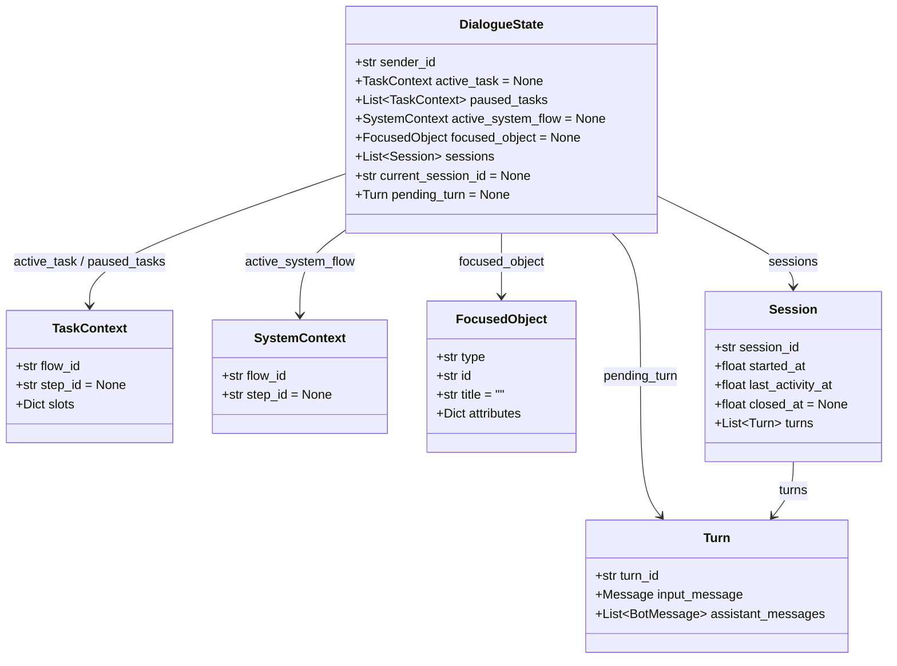
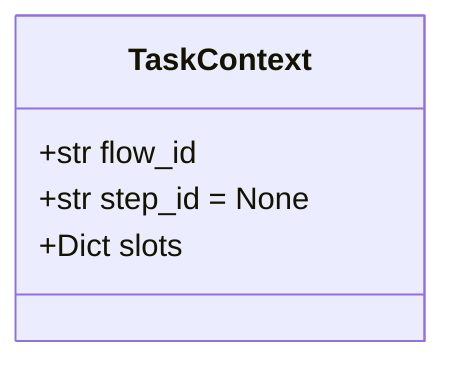
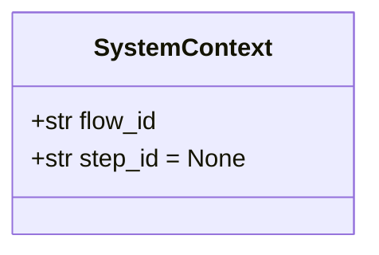
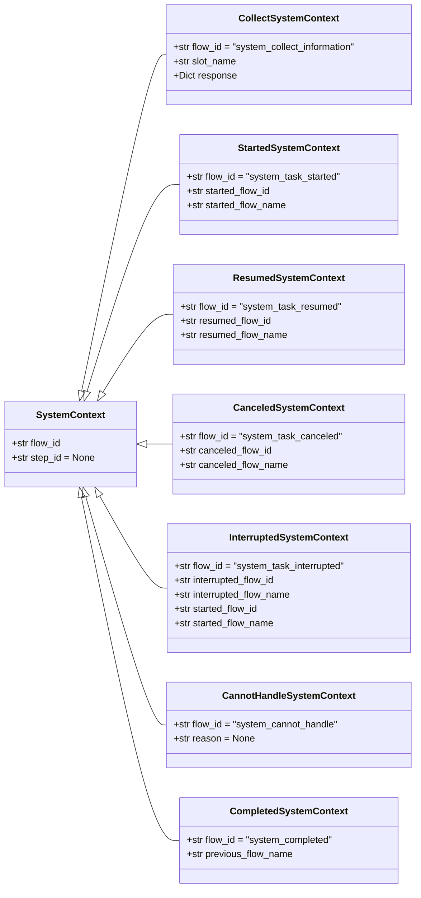
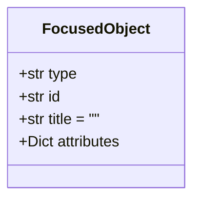
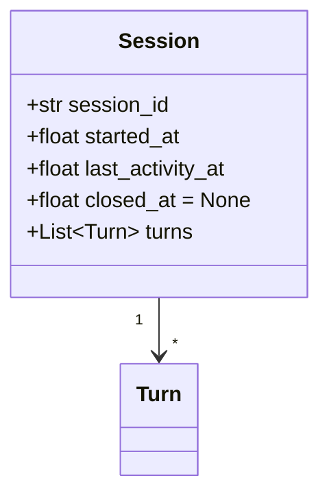
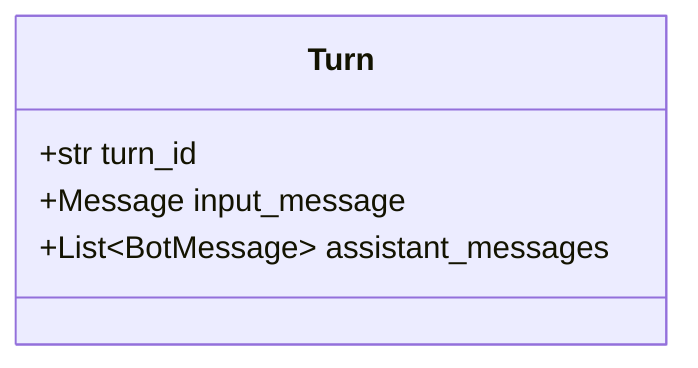

# 对话状态（DialogueState）设计思路

## 1. 概述

`DialogueState` 是对话系统的核心数据结构，记录了与某位用户的完整对话上下文。它以 `sender_id` 为键持久化存储，每次消息处理前从数据库加载，处理完毕后存回。整个处理过程中，所有对话逻辑的读写都发生在同一个 `DialogueState` 实例上。

`DialogueState` 的属性分为四组：**用户任务上下文**、**系统任务上下文**、**聚焦对象**和**会话历史**，每组属性指向一类子结构。



以下各节依次说明四组属性及其子结构的设计意图。

---

## 2. 用户任务上下文

```
active_task: TaskContext | None
paused_tasks: List[TaskContext]
```

用户可以在对话中同时涉及多个业务任务，例如正在办理退款时临时插问一句物流状态。系统的处理方式是：同一时刻只有一个**活跃任务**（`active_task`），被中断的任务压入**挂起列表**（`paused_tasks`），新任务处理完毕后可恢复。`paused_tasks` 是一个有序列表，按挂起的先后顺序排列。

每个任务的执行进度封装在 `TaskContext` 中：

- `flow_id`：标识正在执行的是哪条业务流程
- `step_id`：当前停在该流程的哪个步骤；`None` 表示流程刚创建尚未推进
- `slots`：该流程已收集到的参数，随对话推进逐步填充

以退款申请流程为例，`flow_id` 对应配置文件中的流程名称 `refund_request`，`step_id` 对应流程内某个步骤的 `id`，`slots` 中的键来自该流程涉及的槽位定义：

```yaml
# flow_config/user_flows.yml（节选）

slots:
  order_number:
    type: text
    label: 订单号
  refund_reason:
    type: text
    label: 退款原因

flows:
  refund_request:
    name: 退款申请
    steps:
      - id: start
        type: start
        next: ask_order_number

      - id: ask_order_number       # step_id = "ask_order_number"
        type: collect
        slot_name: order_number
        response:
          text: "请告诉我你的订单号。"
        next: ask_refund_reason

      - id: ask_refund_reason      # step_id = "ask_refund_reason"
        type: collect
        slot_name: refund_reason
        response:
          text: "请简单说一下退款原因。"
        next: refund_submitted

      - id: refund_submitted
        type: action
        action: action_response
        args:
          text: "订单{{ slots.order_number }}的退款申请已提交，原因：{{ slots.refund_reason }}。"
        next: end

      - id: end
        type: end
```

用户说完"我要退款"之后，若已填写订单号、正在等待退款原因，此时 `active_task` 的状态为：

```
flow_id  = "refund_request"
step_id  = "ask_refund_reason"
slots    = {"order_number": "123456"}
```

`slots` 归属于 `TaskContext` 而非 `DialogueState`，因此不同任务的参数空间相互隔离——挂起某个任务时，其已填的 `slots` 完整保留，恢复时从原来的进度继续。



---

## 3. 系统任务上下文

```
active_system_flow: SystemContext | None
```

系统流程是由系统主动发起的一类特殊交互，用于向用户传递系统级通知，例如询问缺失参数、告知任务启动或完成、说明任务被打断等。

`SystemContext` 的基础结构与 `TaskContext` 相同，同样记录流程标识和当前步骤：



系统流程共有 7 种子类型，每种在基础字段之上扩展了各自所需的语义信息，以便响应模板在渲染文案时引用相关数据：



各子类扩展字段的设计说明：

| 子类 | 扩展字段 | 说明 |
|------|---------|------|
| `CollectSystemContext` | `slot_name`、`response` | 需要告知模板当前在收集哪个参数，以及向用户展示的提问内容 |
| `StartedSystemContext` | `started_flow_id`、`started_flow_name` | 需要在通知文案中说明启动了哪个任务 |
| `ResumedSystemContext` | `resumed_flow_id`、`resumed_flow_name` | 需要在通知文案中说明恢复了哪个任务 |
| `CanceledSystemContext` | `canceled_flow_id`、`canceled_flow_name` | 需要在通知文案中说明取消了哪个任务 |
| `InterruptedSystemContext` | `interrupted_*`、`started_*` 各一组 | 需要同时说明哪个任务被打断、哪个新任务被启动 |
| `CannotHandleSystemContext` | `reason` | 可选地携带无法处理的原因 |
| `CompletedSystemContext` | `previous_flow_name` | 需要在完成文案中提及刚刚结束的任务名称 |

---

## 4. 聚焦对象

```
focused_object: FocusedObject | None
```

用户在界面点击某张订单卡片，相当于告知系统"接下来的操作都与这张订单相关"。`focused_object` 记录这个被用户主动选中的业务对象，供后续流程自动填充相关槽位，免去重复询问。会话超时重置后，`focused_object` 随运行时状态一并清空。

- `type`：对象类别，如 `"order"`、`"product"`，决定该对象能映射到哪些槽位
- `id`：对象的核心标识符，如订单号
- `title`：对象的展示名称，如 `"雪地靴 - 36码"`
- `attributes`：扩展属性字典，供后续 Action 读取，如 `{"status": "已发货"}`



---

## 5. 会话历史

```
sessions: List[Session]
current_session_id: str | None
```

`sessions` 永久累积所有历史会话。`current_session_id` 记录当前活跃 Session 的 ID，通过它在 `sessions` 列表中定位当前会话。

`Session` 将若干 `Turn` 按活跃时间窗口分组。用户长时间未发消息后再次进入时，开启新会话并重置运行时状态（任务、系统流程、聚焦对象全部清空），此前的历史记录保留。Session 的时间字段是判断这一边界的依据：`started_at` / `last_activity_at` / `closed_at` 均为 Unix 时间戳，`closed_at` 为 `None` 表示会话仍活跃。



`Turn` 是对话的最小单元，对应一次用户输入与机器人回复的完整交换。`assistant_messages` 是列表，因为机器人可能在一轮中依次发出多条消息。



---

## 6. 处理中的轮次

```
pending_turn: Turn | None
```

每条用户消息进入处理流程时，系统立即创建一个 `Turn` 对象并暂存于 `pending_turn`。此时这条轮次尚未归入任何 `Session`，处于"处理中"状态。待本次消息的全部逻辑执行完毕后，`pending_turn` 才被移入当前 `Session.turns`，并重置为 `None`。

这种两步提交的方式确保了：若处理过程中发生异常，不完整的轮次不会被写入会话历史。`pending_turn` 不参与持久化，它是纯粹的请求内瞬态。

