# DialogueEngine 教材

## 第1章 对话处理流程

`DialogueEngine` 是一轮消息处理的调度中心。

它接收用户消息和 `DialogueState`，判断本轮走哪条处理路径，并返回机器人回复。

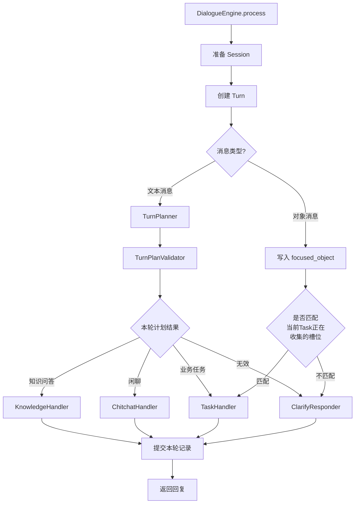

涉及组件如下：

| 组件 | 简要作用 |
| --- | --- |
| `DialogueState` | 保存会话、任务、聚焦对象和历史记录。 |
| `Turn` | 保存本轮用户输入和机器人输出。 |
| `TurnPlanner` | 根据文本消息和状态生成本轮计划。 |
| `TurnPlanValidator` | 检查本轮计划是否可靠、是否可执行。 |
| `ClarifyResponder` | 在计划不清晰时生成追问。 |
| `TaskHandler` | 处理业务任务。 |
| `KnowledgeHandler` | 处理知识问答。 |
| `ChitchatHandler` | 处理闲聊。 |

## 第2章 流程步骤细节

### 1. 准备会话

准备会话的核心问题只有一个：当前会话还能不能继续使用。

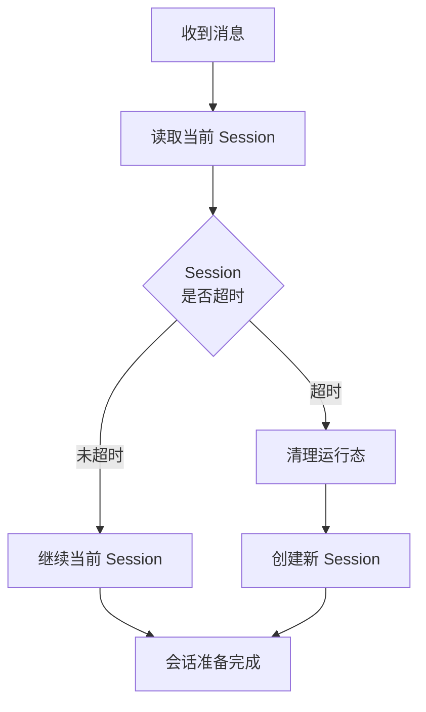

如果会话超时，引擎会清理如下状态：

| 属性 | 处理 |
| --- | --- |
| `active_task` | 清空当前业务任务。 |
| `paused_tasks` | 清空暂停任务。 |
| `active_system_task` | 清空系统流程。 |
| `focused_object` | 清空当前关注对象。 |

### 2. 创建本轮记录

一条用户消息对应一轮对话，也就是一个 `Turn`。

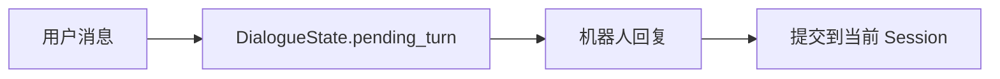

处理过程中，本轮记录暂存在 `DialogueState.pending_turn`。  
本轮结束后，再写入当前 `Session.turns`。

`Turn` 保存：

| 内容 | 说明 |
| --- | --- |
| 用户输入 | 本轮用户说了什么。 |
| 机器人输出 | 本轮系统回复了什么。 |

### 3. 判断消息类型

引擎先区分消息是文本，还是业务对象。

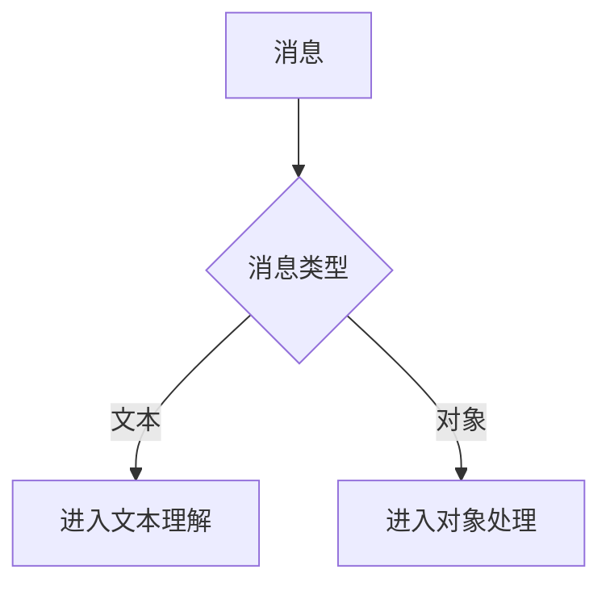

| 类型 | 例子 | 处理重点 |
| --- | --- | --- |
| 文本 | “帮我查一下物流” | 理解用户想做什么。 |
| 对象 | 用户点击了某个订单 | 记录用户当前关注的对象。 |

### 4. 处理对象消息

对象消息通常来自前端点击，例如订单卡片、商品卡片。

引擎会先把对象写入 `DialogueState.focused_object`。

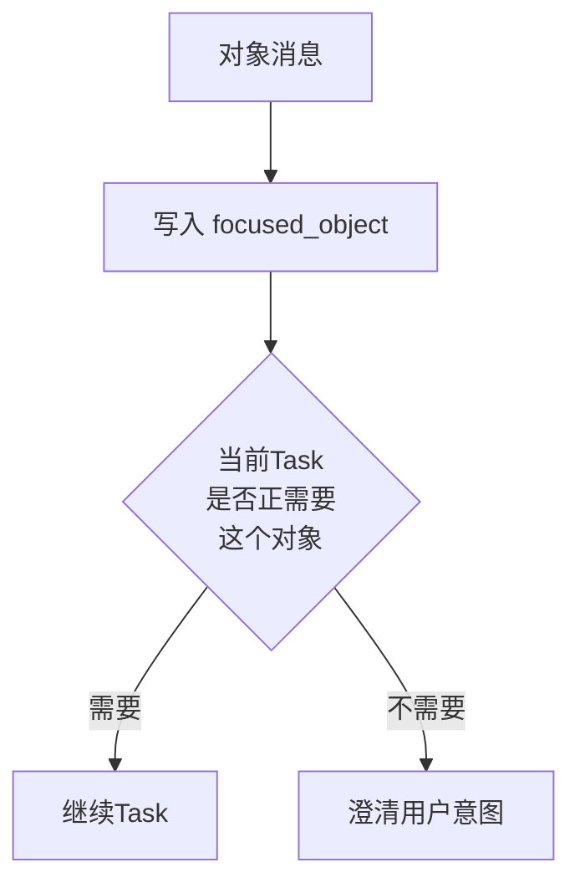

例子：

| 用户操作 | 可能含义 |
| --- | --- |
| 点击订单 | 可能想查订单状态、查物流、申请退款。 |
| 点击商品 | 可能想看商品信息、问发货、问售后。 |

如果对象刚好能补齐当前任务需要的信息，就继续业务任务。  
如果只能知道“用户点了对象”，但不知道“想做什么”，就追问。

### 5. 处理文本消息

文本消息需要先交给 `TurnPlanner` 理解。

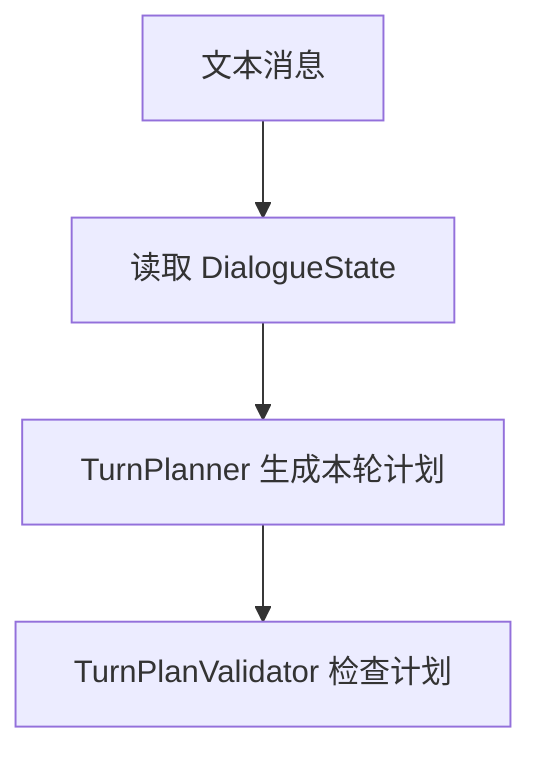

理解时会参考如下信息

| 信息 | 作用 |
| --- | --- |
| 最近对话 | 避免只看一句话造成误判。 |
| `active_task` | 判断用户是否在继续上一件事。 |
| `paused_tasks` | 判断用户是否想回到之前的事。 |
| `focused_object` | 利用订单或商品上下文。 |
| `flows` | 系统支持哪些业务流程，例如查订单、查物流、推荐商品。 |
| `knowledge_intents` | 系统支持哪些知识问答意图，例如商品信息、规则政策、常见问题。 |

`TurnPlanner` 不是凭空理解用户，而是在 `flows` 和 `knowledge_intents` 的能力范围内选择最合适的处理方向。

本轮计划可以先理解成一张“处理决策单”：

| 计划方向 | 具体内容 |
| --- | --- |
| 业务任务 | 启动/恢复/取消  哪个工作流 、设置哪个槽位 |
| 知识问答 | 问哪类知识问题 |
| 闲聊 | 用户不是办业务，也不是问知识，只需要自然回复。 |

一轮计划只能选择一个主要方向。方向不明确时，就不能直接执行。

### 6. 检查理解结果

`TurnPlanner` 的理解结果不能直接使用，需要由 `TurnPlanValidator` 检查。

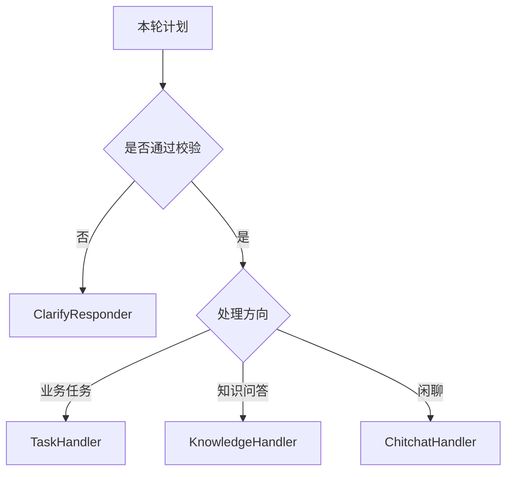

常见需要澄清的情况：

| 情况 | 例子 |
| --- | --- |
| 意图不明确 | “这个怎么办？” |
| 缺少对象 | “它卖多少钱？”，但没有商品。 |
| 多个方向冲突 | 同时像查订单，又像问售后政策。 |
| 系统无法确认 | 用户表达太短或上下文不足。 |

### 7. 澄清处理

当系统无法确定用户目的时，会交给 `ClarifyResponder` 追问。

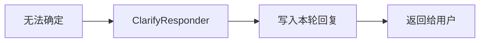

追问的目标是补齐关键信息。追问后，本轮不会继续执行业务处理。

### 8. 进入业务任务

当用户明确要办理业务时，引擎把本轮交给 `TaskHandler`。

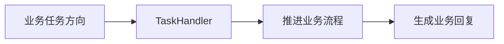

`TaskHandler` 会根据当前状态推进业务流程，并把回复写回本轮 `Turn`。  
例如查订单、查物流、推荐商品，都会走这条方向。

### 9. 进入知识问答

当用户是在问规则、政策、商品信息等问题时，引擎把本轮交给 `KnowledgeHandler`。

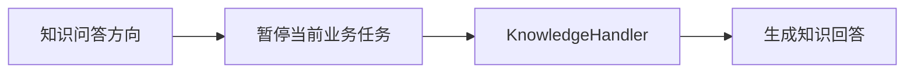

知识问答会先暂停 `active_task`，再进入 `KnowledgeHandler`。  
这样用户临时问一个问题，不会破坏原来的业务流程。

### 10. 进入闲聊

当用户只是问候或简单聊天时，引擎把本轮交给 `ChitchatHandler`。

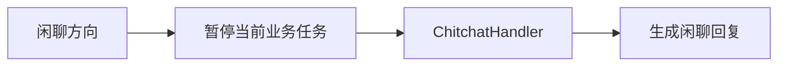

闲聊也会先暂停 `active_task`。它只生成闲聊回复，不推进业务流程。

### 11. 提交本轮记录

无论本轮是业务、知识、闲聊，还是追问，最后都要提交本轮记录。

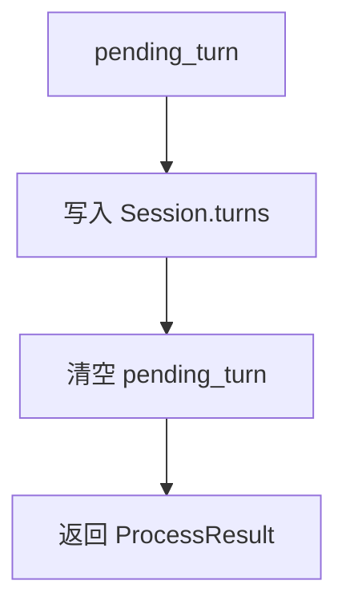

提交后，本轮就成为会话历史的一部分。返回结果包含：

| 内容 | 说明 |
| --- | --- |
| 用户 ID | 标识是谁的对话。 |
| 消息 ID | 标识是哪条消息的处理结果。 |
| 机器人回复 | 本轮要发给用户的消息。 |
