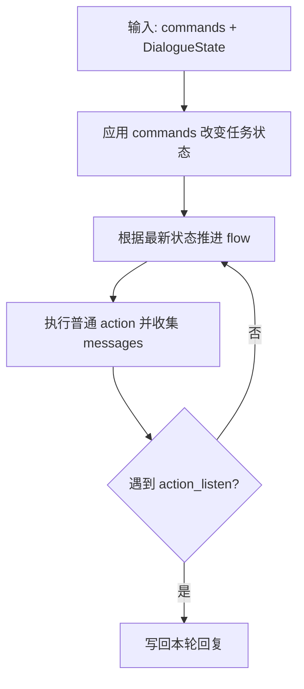
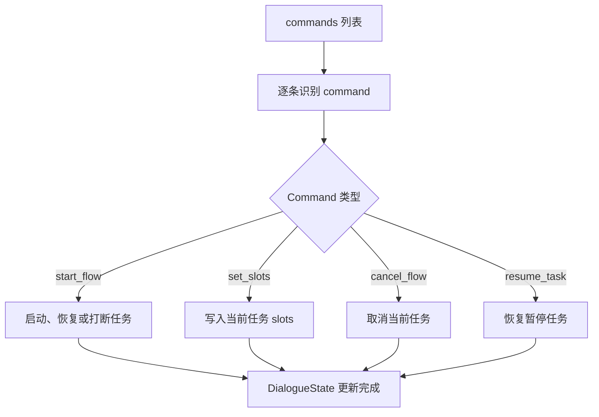
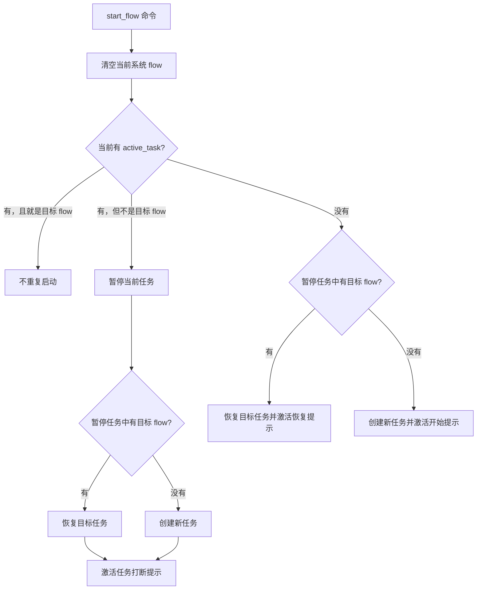
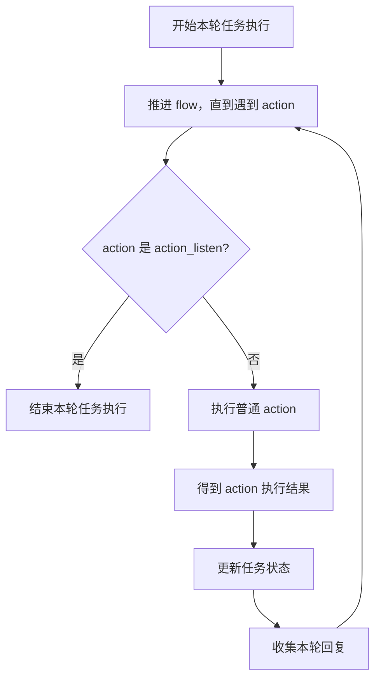
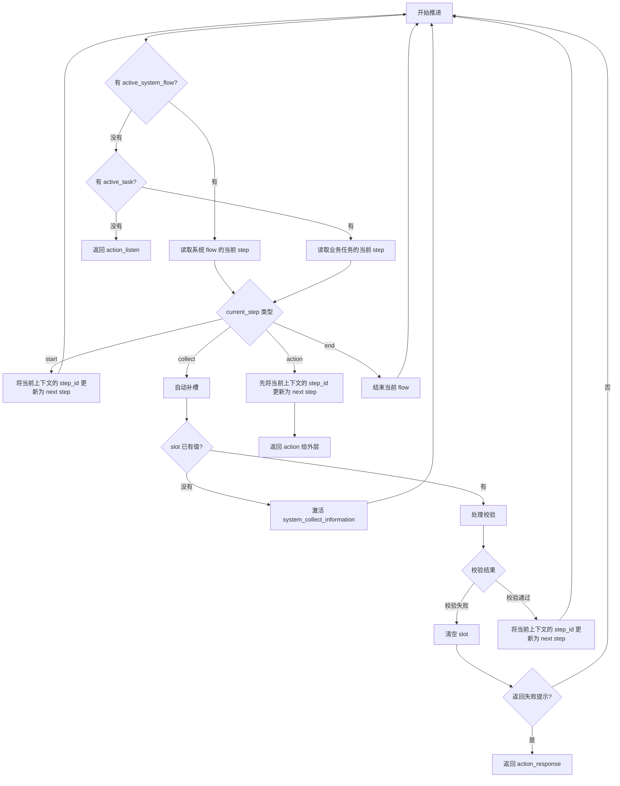

# TaskHandler 教材

## 1. TaskHandler 设计理念

在电商客服系统中，很多业务任务都不是一轮对话就能完成的。

例如用户说“我要退单”，系统可能需要继续追问订单号、退款原因，然后再给出处理结果。这类任务天然是一个多步骤过程。本系统把类似的多步骤任务定义成 `flow`。

本系统将 flow 设计成可配置形式，使用 YAML 文件描述业务流程。这样新增或调整业务流程时，可以优先修改配置，而不是直接改代码。

`TaskHandler` 的职责是便是推进 flow 的执行，并且支持如下能力：

| 能力 | 说明 |
| --- | --- |
| 打断 | 当前正在处理一个 flow 时，用户可以临时切换到另一个 flow。 |
| 恢复 | 被打断的 flow 可以从之前的位置继续。 |
| 取消 | 用户不想继续时，可以取消当前 flow。 |

## 2. Flow 配置语法

### 2.1 设计思想

一个 `flow` 由一系列 `steps` 组成。

每个 `step` 表示流程中的一个节点，每个 step 通过 `next` 指向下一个 step。

具体示例如下：

```yaml
flows:
  flow_id:
    name: 流程名称
    description: 流程说明
    steps:
      - id: start
        type: start
        next: do_something

      - id: do_something
        type: action
        action: action_response
        args:
          text: "这里是一句回复"
        next: end

      - id: end
        type: end
        next: []
```

顶层字段说明：

| 字段 | 说明 |
| --- | --- |
| `flows` | 所有 flow 的根节点。 |
| `flow_id` | flow 的唯一标识，例如 `refund_request`。 |
| `name` | flow 的可读名称。 |
| `description` | flow 的能力说明。 |
| `steps` | flow 包含的步骤列表。 |

### 2.2 step 配置

#### 2.2.1 step 语法概述

一个 step 的基础结构如下：

```yaml
- id: step_id
  type: step_type
  next: next_step_id
```

基础字段说明：

| 字段 | 是否必填 | 说明 |
| --- | --- | --- |
| `id` | 是 | step 在当前 flow 内的唯一标识。 |
| `type` | 是 | step 类型。 |
| `next` | 通常必填 | 当前 step 执行完后进入哪个 step。 |

不同类型的 step 会有不同的额外字段。

#### 2.2.2 type

基础 step type 有三种：

| type | 作用 |
| --- | --- |
| `start` | flow 的起点。 |
| `end` | flow 的终点。 |
| `action` | 执行一个动作。 |

##### 2.2.2.1 start

`start` 表示 flow 的入口。

语法：

```yaml
- id: start
  type: start
  next: next_step_id
```

字段说明：

| 字段 | 说明 |
| --- | --- |
| `id` | 通常写成 `start`。 |
| `type` | 固定写 `start`。 |
| `next` | 指向第一个真正处理业务的 step。 |

示例：

```yaml
- id: start
  type: start
  next: ask_order_number
```

##### 2.2.2.2 end

`end` 表示 flow 的结束。

语法：

```yaml
- id: end
  type: end
  next: []
```

字段说明：

| 字段 | 说明 |
| --- | --- |
| `id` | 通常写成 `end`。 |
| `type` | 固定写 `end`。 |
| `next` | 结束节点没有下一步，写空列表。 |

##### 2.2.2.3 action

`action` 表示执行一个动作。

语法：

```yaml
- id: step_id
  type: action
  action: action_name
  args:
    key: value
  next: next_step_id
```

字段说明：

| 字段 | 说明 |
| --- | --- |
| `id` | 当前 step 的唯一标识。 |
| `type` | 固定写 `action`。 |
| `action` | 要执行的 action 名称。 |
| `args` | 传给 action 的参数，可选。 |
| `next` | action 完成后进入的 step。 |

action 可以分为内置 action 和自定义 action，其中内置 action 有 `action_response` 和 `action_listen`。

###### 2.2.2.3.1 action_response

`action_response` 用来向用户回复消息。

语法：

```yaml
- id: respond
  type: action
  action: action_response
  args:
    text: "回复内容"
  next: next_step_id
```

常用args参数：

| 参数 | 说明 |
| --- | --- |
| `mode` | 回复模式，可选值为 `static`、`rephrase`、`generate`，默认是 `static`。 |
| `text` | 回复给用户的文本。在 `static` 和 `rephrase` 模式下常用。 |
| `prompt` | 需要大模型改写或生成回复时使用。在 `rephrase` 和 `generate` 模式下常用。 |

`mode` 决定 `action_response` 如何生成回复：

| mode | 作用 | 常用字段 |
| --- | --- | --- |
| `static` | 直接把 `text` 渲染后回复给用户。 | `text` |
| `rephrase` | 先渲染 `text` 作为建议回复，再用 `prompt` 让大模型改写。 | `text`、`prompt` |
| `generate` | 不依赖固定 `text`，直接用 `prompt` 生成回复。 | `prompt` |

普通回复示例：

```yaml
- id: ask_order_number
  type: action
  action: action_response
  args:
    text: "请告诉我你的订单号。"
  next: listen_order_number
```

上面没有显式写 `mode`，等价于使用默认的 `static` 模式。

显式声明 `static` 的示例：

```yaml
- id: ask_order_number
  type: action
  action: action_response
  args:
    mode: static
    text: "请告诉我你的订单号。"
  next: listen_order_number
```

`rephrase` 模式示例：

```yaml
- id: not_supported
  type: action
  action: action_response
  args:
    mode: rephrase
    text: "我理解你的意思，不过这个能力目前还没有接入。"
    prompt: |
      你是一个中文电商客服助手，语气自然、友好、简洁。
      请基于下面的建议回复，生成一句更自然的中文回复，保持原意，不要扩写。
      对话上下文：
      {{ history }}
      用户最后一句：
      用户：{{ user_message }}
      建议回复：{{ current_response }}
      改写后的回复：
  next: end
```

`generate` 模式示例：

```yaml
- id: generate_reply
  type: action
  action: action_response
  args:
    mode: generate
    prompt: |
      你是一个中文电商客服助手。
      请根据当前对话上下文，生成一句简洁自然的回复。
      对话上下文：
      {{ history }}
      用户最后一句：
      用户：{{ user_message }}
      回复：
  next: end
```

`action_response` 支持变量引用。

常见变量有两类：

| 变量 | 说明 |
| --- | --- |
| `slots` | 当前业务 flow 中已经收集或写入的信息。 |
| `context` | 当前系统 flow 的上下文信息。 |

引用 slots 的示例：

```yaml
- id: refund_submitted
  type: action
  action: action_response
  args:
    text: "好的，订单{{ slots.order_number }}的退款申请已提交，原因是：{{ slots.refund_reason }}。"
  next: end
```

这里：

| 写法 | 含义 |
| --- | --- |
| `{{ slots.order_number }}` | 当前 flow 中的订单号。 |
| `{{ slots.refund_reason }}` | 当前 flow 中的退款原因。 |

引用 context 的示例：

```yaml
- id: acknowledge
  type: action
  action: action_response
  args:
    text: "好的，我们先处理{{ context.started_flow_name }}。"
  next: end
```

这里的 `{{ context.started_flow_name }}` 表示当前系统上下文中的任务名称。

###### 2.2.2.3.2 action_listen

`action_listen` 表示等待用户下一轮输入。

语法：

```yaml
- id: listen
  type: action
  action: action_listen
  next: next_step_id
```

字段说明：

| 字段 | 说明 |
| --- | --- |
| `action` | 固定写 `action_listen`。 |
| `args` | 通常不需要。 |
| `next` | 用户补充信息后继续进入的 step。 |

示例：

```yaml
- id: listen_order_number
  type: action
  action: action_listen
  next: ask_refund_reason
```

###### 2.2.2.3.3 自定义 action

自定义 action 用来处理项目自己的业务逻辑。

语法：

```yaml
- id: custom_step_id
  type: action
  action: custom_action_name
  args:
    key: value
  next: next_step_id
```

当前项目中已有的自定义 action：

| action | 说明 |
| --- | --- |
| `action_lookup_order_status` | 查询订单状态。 |
| `action_lookup_logistics` | 查询物流信息。 |
| `action_recommend_similar_products` | 推荐相似商品。 |

示例：

```yaml
- id: lookup_order_status
  type: action
  action: action_lookup_order_status
  next: show_order_status
```

自定义 action 通常负责查询或处理业务数据，后续再用 `action_response` 把结果回复给用户。

#### 2.2.4 next

`next` 用来声明当前 step 执行完成后进入哪个 step。

##### 2.2.4.1 静态跳转

最简单的写法是直接指定下一个 step：

```yaml
next: next_step_id
```

示例：

```yaml
- id: start
  type: start
  next: ask_order_number
```

##### 2.2.4.2 条件跳转

如果下一步要根据条件决定，可以使用条件分支。

语法：

```yaml
next:
  - if: "条件表达式"
    then: step_a
  - else: step_b
```

字段说明：

| 字段 | 说明 |
| --- | --- |
| `if` | 条件表达式。 |
| `then` | 条件成立时进入的 step。 |
| `else` | 前面条件都不成立时进入的 step。 |

示例：

```yaml
- id: start
  type: start
  next:
    - if: "slots.get('product_id')"
      then: respond
    - else: missing_product_context
```

这个配置表示：

| 条件 | 下一步 |
| --- | --- |
| `slots` 中有 `product_id` | 进入 `respond`。 |
| 否则 | 进入 `missing_product_context`。 |

条件表达式可以读取：

| 名称 | 说明 |
| --- | --- |
| `slots` | 当前业务字段。 |
| `context` | 当前系统上下文。 |
| `flow_id` | 当前 flow ID。 |
| `step_id` | 当前 step ID。 |

多个条件会按顺序判断，命中第一个成立的分支。

### 2.3 collect step 的引入

#### 2.3.1 使用基础语法写退单流程

先只使用前面讲过的基础语法，实现一个退单流程。

```yaml
flows:
  refund_request:
    name: 退款申请
    description: 帮用户提交退款申请，收集订单号和退款原因。
    steps:
      - id: start
        type: start
        next: ask_order_number

      - id: ask_order_number
        type: action
        action: action_response
        args:
          text: "请告诉我你的订单号。"
        next: listen_order_number

      - id: listen_order_number
        type: action
        action: action_listen
        next: ask_refund_reason

      - id: ask_refund_reason
        type: action
        action: action_response
        args:
          text: "请简单说一下退款原因。"
        next: listen_refund_reason

      - id: listen_refund_reason
        type: action
        action: action_listen
        next: refund_submitted

      - id: refund_submitted
        type: action
        action: action_response
        args:
          text: "好的，订单{{ slots.order_number }}的退款申请已提交，原因是：{{ slots.refund_reason }}。后续会尽快为你处理。"
        next: end

      - id: end
        type: end
        next: []
```

这个 flow 的步骤如下：

| step | 说明 |
| --- | --- |
| `ask_order_number` | 询问订单号。 |
| `listen_order_number` | 等待用户输入订单号。 |
| `ask_refund_reason` | 询问退款原因。 |
| `listen_refund_reason` | 等待用户输入退款原因。 |
| `refund_submitted` | 回复退单申请已提交。 |

#### 2.3.2 暴露重复问题

上面的配置可以表达退单流程，但收集 slot 的步骤写得很重复。

收集订单号时，需要：

1. `action_response` 问用户订单号。
2. `action_listen` 等用户回答。

收集退款原因时，也需要：

1. `action_response` 问用户退款原因。
2. `action_listen` 等用户回答。

也就是说，每收集一个 slot，都要重复写一组“问 + 等”的结构。

如果一个业务要收集 5 个字段，就要重复写 5 组类似配置。flow 会变得又长又啰嗦。

真正的业务意图其实是：

| 想表达的业务含义 | 不想重复写的细节 |
| --- | --- |
| 我要收集订单号。 | 怎么问、怎么等。 |
| 我要收集退款原因。 | 怎么问、怎么等。 |

因此，需要引入一个新的 step type：`collect`。

#### 2.3.3 引入 collect step

`collect` step 用来表达“当前流程需要某个 slot”。

语法：

```yaml
- id: step_id
  type: collect
  slot_name: slot_name
  response:
    text: "询问用户的话"
  next: next_step_id
```

字段说明：

| 字段 | 说明 |
| --- | --- |
| `id` | step 唯一标识。 |
| `type` | 固定写 `collect`。 |
| `slot_name` | 要收集的 slot 名称。 |
| `response` | slot 缺失时，用什么话询问用户。 |
| `next` | slot 已具备后，进入哪个 step。 |

示例：

```yaml
- id: ask_order_number
  type: collect
  slot_name: order_number
  response:
    text: "请告诉我你的订单号。"
  next: ask_refund_reason
```

含义：

| 情况 | 行为 |
| --- | --- |
| `order_number` 已经有值 | 直接进入 `ask_refund_reason`。 |
| `order_number` 没有值 | 询问用户订单号，并等待用户输入。 |

#### 2.3.4 CollectSystemFlow 定义

`collect` 之所以能省掉“问 + 等”的重复配置，是因为系统定义了一个专门的 `CollectSystemFlow`。

它的 flow ID 是 `system_collect_information`。

真实配置如下：

```yaml
flows:
  system_collect_information:
    description: Flow for asking the user for a slot value during a collect step
    name: collect information
    steps:
      - id: start
        type: start
        next: ask

      - id: ask
        type: action
        action: action_response
        args: context.response
        next: listen

      - id: listen
        type: action
        action: action_listen
        next: end

      - id: end
        type: end
        next: []
```

这里最关键的是：

```yaml
args: context.response
```

它表示：`action_response` 的参数整体来自 `context.response`。

例如业务 flow 中有这样一个完整的 `collect` step：

```yaml
- id: ask_order_number
  type: collect
  slot_name: order_number
  response:
    text: "请告诉我你的订单号。"
  next: ask_refund_reason
```

其中的 `response` 部分会被放入系统上下文。进入 `system_collect_information` 时，`context.response` 就相当于：

```yaml
text: "请告诉我你的订单号。"
```

所以：

```yaml
args: context.response
```

等价于把这个 collect step 中的 `response` 整体替换成 `action_response` 的 `args`。

这样，`system_collect_information` 就可以复用同一套“回复 + 等待”逻辑，而具体问什么由业务 flow 的 collect step 决定。

#### 2.3.5 引入 collect 后的退单流程示例

有了 `collect` 后，退单 flow 可以写成：

```yaml
flows:
  refund_request:
    name: 退款申请
    description: 帮用户提交简单的退款申请，收集订单号和退款原因。
    steps:
      - id: start
        type: start
        next: ask_order_number

      - id: ask_order_number
        type: collect
        slot_name: order_number
        response:
          text: "请告诉我你的订单号。"
        next: ask_refund_reason

      - id: ask_refund_reason
        type: collect
        slot_name: refund_reason
        response:
          text: "请简单说一下退款原因。"
        next: refund_submitted

      - id: refund_submitted
        type: action
        action: action_response
        args:
          text: "好的，订单{{ slots.order_number }}的退款申请已提交，原因是：{{ slots.refund_reason }}。后续会尽快为你处理。"
        next: end

      - id: end
        type: end
        next: []
```

对比基础版本：

| 基础版本 | collect 版本 |
| --- | --- |
| 每个 slot 都要写 `action_response`。 | 每个 slot 只写一个 `collect`。 |
| 每个 slot 都要写 `action_listen`。 | 等待逻辑由 `system_collect_information` 统一处理。 |
| 配置更关注交互细节。 | 配置更关注业务需要什么信息。 |

### 2.5 其余 SystemFlow

SystemFlow 用来描述系统级交互。

除了前面讲过的 `system_collect_information`，项目中还有以下 SystemFlow。

#### 2.5.1 system_task_started

作用：新任务开始时，告诉用户当前先处理哪个任务。

```yaml
flows:
  system_task_started:
    description: Flow for acknowledging that a new task has started
    name: task started acknowledgement
    steps:
      - id: start
        type: start
        next: acknowledge

      - id: acknowledge
        type: action
        action: action_response
        args:
          mode: static
          text: "好的，我们先处理{{ context.started_flow_name }}。"
        next: end

      - id: end
        type: end
        next: []
```

#### 2.5.2 system_task_resumed

作用：恢复暂停任务时，告诉用户继续处理刚才的任务。

```yaml
flows:
  system_task_resumed:
    description: Flow for acknowledging that a paused task has been resumed
    name: task resumed acknowledgement
    steps:
      - id: start
        type: start
        next: acknowledge

      - id: acknowledge
        type: action
        action: action_response
        args:
          mode: static
          text: "好的，我们继续刚才的{{ context.resumed_flow_name }}。"
        next: end

      - id: end
        type: end
        next: []
```

#### 2.5.3 system_task_interrupted

作用：当前任务被打断时，告诉用户先把旧任务放一放。

```yaml
flows:
  system_task_interrupted:
    description: Flow for acknowledging that the current task has been interrupted
    name: task interrupted acknowledgement
    steps:
      - id: start
        type: start
        next: acknowledge

      - id: acknowledge
        type: action
        action: action_response
        args:
          mode: static
          text: "好的，我们先把{{ context.interrupted_flow_name }}放一放。"
        next:
          - if: "context.get('started_flow_name')"
            then: announce_started
          - else: end

      - id: announce_started
        type: action
        action: action_response
        args:
          mode: static
          text: "好的，我们先处理{{ context.started_flow_name }}。"
        next: end

      - id: end
        type: end
        next: []
```

这个 flow 同时用到了：

| 语法 | 位置 |
| --- | --- |
| `context.interrupted_flow_name` | 回复被打断的任务名称。 |
| 条件分支 | 判断是否需要继续宣布新任务开始。 |

#### 2.5.4 system_task_canceled

作用：当前任务被取消时，告诉用户已取消。

```yaml
flows:
  system_task_canceled:
    description: Flow for acknowledging that the current task was canceled
    name: task canceled acknowledgement
    steps:
      - id: start
        type: start
        next: acknowledge

      - id: acknowledge
        type: action
        action: action_response
        args:
          mode: static
          text: "好的，{{ context.canceled_flow_name }}先帮你取消。"
        next: end

      - id: end
        type: end
        next: []
```

#### 2.5.5 system_completed

作用：业务 flow 完成后的系统收尾。

当前配置中它只做完成标记，不额外回复用户。

```yaml
flows:
  system_completed:
    description: A flow has been completed and there is nothing else to be done
    name: completion marker
    steps:
      - id: start
        type: start
        next: end

      - id: end
        type: end
        next: []
```

#### 2.5.6 system_cannot_handle

作用：系统无法处理当前请求时，给出兜底回复。

这个 flow 会根据 `context.reason` 选择不同回复。

```yaml
flows:
  system_cannot_handle:
    description: Flow for handling requests the assistant cannot support
    name: cannot handle request
    steps:
      - id: start
        type: start
        next:
          - if: "context.get('reason') == 'clarification_rejected'"
            then: clarification_rejected
          - if: "context.get('reason') == 'not_supported'"
            then: not_supported
          - if: "context.get('reason') == 'no_relevant_answer'"
            then: no_relevant_answer
          - else: ask_rephrase

      - id: clarification_rejected
        type: action
        action: action_response
        args:
          mode: rephrase
          text: "看来我刚才理解偏了。你可以重新说一下你想查订单、查物流，还是申请退款吗？"
        next: end

      - id: not_supported
        type: action
        action: action_response
        args:
          mode: rephrase
          text: "我理解你的意思，不过这个能力目前还没有接入。"
        next: end

      - id: no_relevant_answer
        type: action
        action: action_response
        args:
          mode: rephrase
          text: "我暂时没有查到合适的信息。你可以换个说法，或者告诉我更具体一点的商品或订单信息。"
        next: end

      - id: ask_rephrase
        type: action
        action: action_response
        args:
          mode: rephrase
          text: "抱歉，我这边没有完全听明白。你可以再具体说一下你想处理什么电商问题吗？"
        next: end

      - id: end
        type: end
        next: []
```

分支含义：

| reason | 进入 step | 说明 |
| --- | --- | --- |
| `clarification_rejected` | `clarification_rejected` | 澄清失败，引导用户重新说明。 |
| `not_supported` | `not_supported` | 当前能力未接入。 |
| `no_relevant_answer` | `no_relevant_answer` | 没有找到合适答案。 |
| 其他情况 | `ask_rephrase` | 请用户换个说法。 |

### 2.6 Flow 语法总结

#### 2.6.1 flow 顶层语法

```yaml
flows:
  flow_id:
    name: 流程名称
    description: 流程说明
    steps: []
```

#### 2.6.2 step 通用语法

```yaml
- id: step_id
  type: step_type
  next: next_step_id
```

#### 2.6.3 step type 汇总

| type | 作用 | 常见字段 |
| --- | --- | --- |
| `start` | flow 起点 | `id`、`type`、`next` |
| `end` | flow 终点 | `id`、`type`、`next` |
| `action` | 执行动作 | `id`、`type`、`action`、`args`、`next` |
| `collect` | 收集 slot | `id`、`type`、`slot_name`、`response`、`next` |

#### 2.6.4 action 汇总

| action | 作用 |
| --- | --- |
| `action_response` | 回复用户，支持变量引用。 |
| `action_listen` | 控制信号，表示等待用户下一轮输入。 |
| 自定义 action | 执行业务逻辑。 |

#### 2.6.5 next 汇总

静态跳转：

```yaml
next: step_id
```

条件跳转：

```yaml
next:
  - if: "条件表达式"
    then: step_a
  - else: step_b
```

#### 2.6.6 变量引用汇总

| 写法 | 说明 |
| --- | --- |
| `{{ slots.xxx }}` | 引用业务 slot。 |
| `{{ context.xxx }}` | 引用系统上下文。 |

#### 2.6.7 SystemFlow 汇总

| SystemFlow | 作用 |
| --- | --- |
| `system_collect_information` | 收集 slot 时追问用户并等待输入。 |
| `system_task_started` | 新任务开始提示。 |
| `system_task_resumed` | 任务恢复提示。 |
| `system_task_interrupted` | 任务被打断提示。 |
| `system_task_canceled` | 任务取消提示。 |
| `system_completed` | 任务完成收尾。 |
| `system_cannot_handle` | 无法处理请求时的兜底回复。 |

## 3. Command

### 3.1 概述

前面说过，`TaskHandler` 要支持任务的启动、打断、取消和恢复。

这说明 flow 执行不是简单地从 `start` 一直跑到 `end`。

在每一轮对话开始时，系统都可能需要先改变任务状态。

例如：

| 用户输入 | 任务状态变化 |
| --- | --- |
| “我要退款” | 启动退款任务。 |
| “先帮我查下物流” | 暂停当前任务，启动物流任务。 |
| “算了，不退了” | 取消当前任务。 |
| “继续刚才那个” | 恢复之前暂停的任务。 |
| “订单号是 10086” | 补充当前任务的订单号。 |

这些变化不是 flow 中的普通 step，而是对任务状态本身的操作。

系统把这种“本轮对任务状态的操作”抽象成 `Command`。

一句话概括：

**Command 是本轮用户输入对任务状态产生的结构化操作。**

当前系统中，Command 有如下四类：

| Command | 作用 |
| --- | --- |
| `start_flow` | 启动一个业务 flow。 |
| `cancel_flow` | 取消当前正在处理的业务 flow。 |
| `resume_flow` | 恢复之前暂停的业务任务。 |
| `set_slots` | 写入一个或多个业务 slot。 |

### 3.2 start_flow

`start_flow` 表示启动一个业务流程。

例如用户说“我要退款”，对应的任务操作是：

```json
{
  "command": "start_flow",
  "flow": "refund_request"
}
```

含义是：启动 `refund_request` 这个 flow。

这里的 `flow` 必须是业务 flow，不能直接启动 `system_` 开头的系统 flow。

如果当前已经有活跃任务，再启动另一个业务 flow，当前任务可能会被暂停，新任务会成为活跃任务。

### 3.3 set_slots

`set_slots` 表示向当前任务写入业务信息。

例如退款流程正在等待订单号，用户说“订单号是 10086”，对应的任务操作是：

```json
{
  "command": "set_slots",
  "slots": {
    "order_number": "10086"
  }
}
```

含义是：把 `order_number` 写入当前活跃任务的 slots。

`set_slots` 可以一次写入多个 slot：

```json
{
  "command": "set_slots",
  "slots": {
    "order_number": "10086",
    "refund_reason": "商品有破损"
  }
}
```

### 3.4 cancel_flow

`cancel_flow` 表示取消当前正在处理的业务流程。

例如用户说“算了，不退了”，对应的任务操作是：

```json
{
  "command": "cancel_flow"
}
```

含义是：取消当前活跃任务。

如果当前没有活跃任务，这条 Command 不会产生实际影响。

### 3.5 resume_task

`resume_task` 表示恢复之前暂停的任务。

例如用户说“继续刚才那个”，对应的任务操作是：

```json
{
  "command": "resume_task",
  "flow": "refund_request"
}
```

含义是：从暂停任务中恢复 `refund_request`。

### 3.6 Command 小结

`Command` 是 flow 执行前的一层任务操作。

它把“本轮对话要如何改变任务状态”表达成结构化数据。

| 用户输入 | 任务状态变化 | Command |
| --- | --- | --- |
| “我要退款” | 启动退款任务。 | `start_flow` |
| “先查物流” | 暂停当前任务，启动物流任务。 | `start_flow` |
| “订单号是 10086” | 写入订单号。 | `set_slots` |
| “算了，不退了” | 取消当前任务。 | `cancel_flow` |
| “继续刚才那个” | 恢复暂停任务。 | `resume_task` |

有了 `Command` 之后，`TaskHandler` 就可以先处理任务状态变化，再继续推进 flow。

## 4. TaskHandler 的消息处理流程

### 4.1 概述

`TaskHandler` 是任务轨道的一轮处理入口。

它接收已经解析好的 `commands` 和当前 `DialogueState`，先更新任务状态，再推进 flow，最后把本轮产生的客服回复写入当前对话轮次。

TaskHandler 先处理 Command，再运行 flow，最后把本轮回复写入 `pending_turn`。

整体流程图如下：



这一轮处理涉及以下几个对象：

| 关键词 | 含义 |
| --- | --- |
| `commands` | 本轮用户输入对任务状态产生的结构化操作。 |
| `DialogueState` | 当前对话里正在办理、暂停、等待补充的信息。 |
| flow 推进 | 根据最新状态持续寻找并执行 action，直到遇到 `action_listen`。 |
| `messages` | 本轮 flow 推进过程中产生的客服回复。 |

任务执行循环结束后，本轮所有客服回复会汇总为 `messages` 列表，并追加到 `pending_turn.assistant_messages`。

`pending_turn` 表示正在处理中的当前轮次。一条用户消息可能触发多条客服回复，这些回复会先保存在同一个 `pending_turn` 上。

例如：

| 用户输入 | 同一轮中可能产生的回复 |
| --- | --- |
| “我要退款” | “好的，我们先处理退款申请。” |
| “我要退款” | “请告诉我你的订单号。” |

更外层的对话引擎提交当前轮次后，`pending_turn` 才会进入会话历史。

### 4.2 CommandProcessor

在任务系统里，用户输入不会直接推动某个 step。它会先被转换成 Command，再由 Command 改变 `DialogueState`。

这一阶段先更新状态，再继续推进流程。



任务处理相关的状态字段如下：

| 状态字段 | 作用 |
| --- | --- |
| `active_task` | 当前正在办理的业务任务。 |
| `paused_tasks` | 被打断后暂存的业务任务。 |
| `active_system_task` | 当前优先执行的系统 flow。 |
| `active_task.slots` | 当前任务已经收集到的业务字段。 |
| `focused_object` | 当前聚焦的订单或商品，可用于自动补全部分 slot。 |

不同 Command 对状态的影响如下：

| Command | 状态变化 |
| --- | --- |
| `start_flow` | 启动目标业务 flow；如果已有其他任务，会先暂停旧任务；如果目标任务在暂停列表中，则恢复它。 |
| `set_slots` | 把用户补充的信息写入当前任务。 |
| `cancel_flow` | 取消当前任务，并激活取消提示。 |
| `resume_task` | 从暂停任务中恢复一个任务，并激活恢复提示。 |

`start_flow` 是状态变化最多的 Command。

在当前教学项目中，规划层只生成业务 flow，不把系统 flow 作为目标 flow。因此 `start_flow` 的处理重点是当前是否已有任务，以及目标任务是否处于暂停列表中。

流程如下：



典型场景如下：

| 当前状态 | 用户输入 | 结果 |
| --- | --- | --- |
| 没有任务 | “我要退款” | 创建退款任务，并提示开始处理退款。 |
| 正在退款 | “我要退款” | 已经在处理同一个任务，不重复启动。 |
| 正在退款 | “先帮我查物流” | 暂停退款任务，启动物流任务，并提示任务被切换。 |
| 没有活跃任务，但之前暂停过退款 | “继续退款” | 恢复退款任务，并提示继续刚才的任务。 |

`start_flow` 负责调整任务栈，包括当前任务、暂停任务和系统提示，不负责执行 flow。

### 4.3 FlowExecutor

状态更新完成后，系统才开始推进 flow。`FlowExecutor` 里有两层循环，内层负责找下一个 action，外层负责执行内层返回的 action。

| 层次 | 负责什么 | 什么时候停 |
| --- | --- | --- |
| 外层：`run_task` | 执行action，并处理 action 返回的结果。 | 遇到 `action_listen`。 |
| 内层：`advance_until_action` | 在 flow 里连续推进，直到找到一个 action。 | 找到一个 action。 |

外层循环对应一轮消息里的任务执行过程。

`run_task` 每次都会先调用 `advance_until_action` 获取下一个 action。返回 `action_listen` 时，本轮任务执行结束；返回普通 action 时，系统继续执行。

普通 action 执行后会返回结果。结果主要包含两类内容：

| 内容 | 作用 |
| --- | --- |
| 要回复给用户的话 | 追加到本轮回复列表里，最后写入当前对话轮次。 |
| 要更新到任务状态里的值 | 写回 slots，供后续 flow 或回复模板继续使用。 |



内层存循环只负责向前推进并返回一个 action，推进流程如下：

内层循环每次都会先确定当前要推进的对象：

| 当前状态 | 内层循环的处理 |
| --- | --- |
| 有 `active_system_flow` | 推进系统 flow。 |
| 没有 `active_system_flow`，但有 `active_task` | 推进业务任务。 |
| 两者都没有 | 返回 `action_listen`。 |

确定当前 flow 后，内层循环围绕当前 step 继续处理：

| 当前 step 类型 | 处理方式 | 本轮结果 |
| --- | --- | --- |
| `start` | 将当前上下文的 `step_id` 更新为 next step。 | 继续推进。 |
| `collect` | 先自动补槽，再执行校验；slot 已有值时推进到 next step；slot 仍缺失时激活 `system_collect_information`。 | 继续推进，或返回 `action_response`。 |
| `action` | 先将当前上下文的 `step_id` 更新为 next step，再生成 action。 | 返回 action 给外层。 |
| `end` | 结束当前 flow。 | 继续推进。 |

`advance_until_action` 的流程如下：


