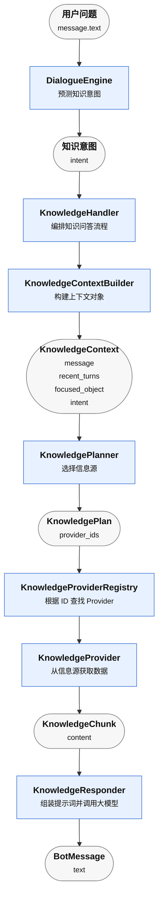
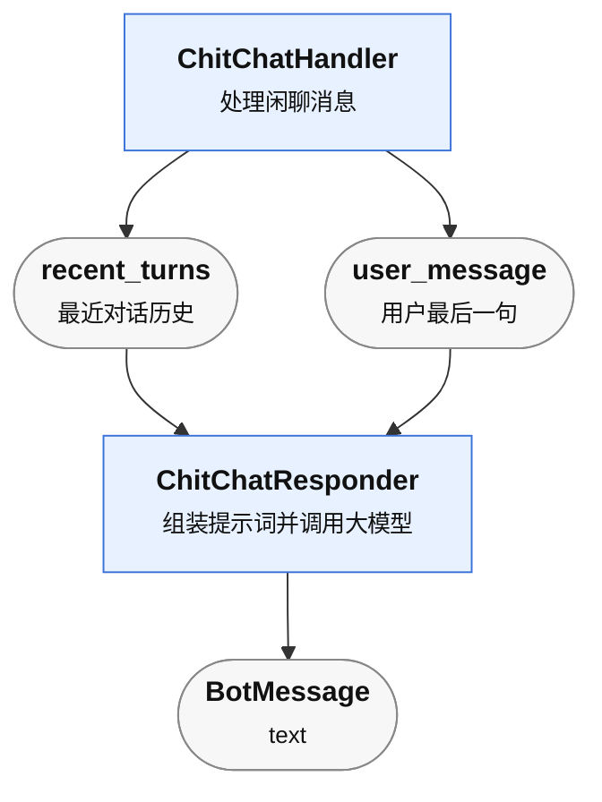

# 1. KnowledgeHandler概述

`KnowledgeHandler` 的大致思路是：

**根据用户问题检索信息，将检索到的信息连同用户问题一起交给大模型生成回复。**

`KnowledgeHandler` 中定义了如下几个知识意图，TurnPlanner会将用户问题归到某个知识意图。

| 知识意图 | 说明 |
| --- | --- |
| `product_info` | 商品信息咨询。 |
| `order_info` | 订单信息咨询。 |
| `refund_policy` | 退款政策咨询。 |
| `return_policy` | 退货政策咨询。 |
| `shipping_policy` | 配送政策咨询。 |
| `platform_rule` | 平台规则咨询。 |
| `general_ecommerce_info` | 电商通用信息咨询。 |

不同意图会对应不同的信息源，当前系统中的信息源主要有三类：

| 信息源 | 说明 |
| --- | --- |
| `api` | 查询实时业务数据，例如商品、订单。 |
| `faq` | 查询标准问答。 |
| `rag` | 查询文档知识库。 |

意图和信息源的关系如下：

| 知识意图 | 信息源列表 |
| --- | --- |
| `product_info` | `api.product`、`faq.default`、`rag.default` |
| `order_info` | `api.order`、`faq.default`、`rag.default` |
| `refund_policy` | `faq.default`、`rag.default` |
| `return_policy` | `faq.default`、`rag.default` |
| `shipping_policy` | `faq.default`、`rag.default` |
| `platform_rule` | `rag.default` |
| `general_ecommerce_info` | `faq.default`、`rag.default` |

综上所属，KnowledgeHandler的具体流程如下：

涉及组件说明如下：

| 组件 | 说明 |
| --- | --- |
| `DialogueEngine` | 根据用户消息预测知识意图，并把知识问答交给 `KnowledgeHandler`。 |
| `KnowledgeHandler` | 知识问答处理入口，负责编排后续组件。 |
| `KnowledgeContextBuilder` | 构建本轮知识问答上下文，例如用户消息、最近历史、聚焦对象和知识意图。 |
| `KnowledgePlanner` | 根据知识意图和上下文选择本轮要查询的信息源。 |
| `KnowledgePlan` | 保存本轮要查询的 `provider_ids`。 |
| `KnowledgeProviderRegistry` | 根据 provider ID 找到对应的 `KnowledgeProvider`。 |
| `KnowledgeProvider` | 从具体信息源中获取数据。 |
| `KnowledgeChunk` | 表示检索到的一段信息。 |
| `KnowledgeResponder` | 将检索到的信息和用户问题组装成提示词，交给大模型生成回复。 |
| `BotMessage` | 最终返回给用户的客服消息。 |

# 2. ChitChatHandler 概述

`ChitChatHandler` 的大致思路是：

**读取最近对话历史，将历史和用户最后一句话一起交给大模型，生成自然的闲聊回复。**

具体流程如下：

