# 1. 实现思路

`TaskHandler` 是任务轨道的入口。

它不负责理解用户自然语言，也不负责读写数据库。它只接收已经解析好的 `commands` 和当前 `DialogueState`，然后推进任务流程。

它内部主要依赖三个对象：

| 对象 | 职责 |
| --- | --- |
| `CommandProcessor` | 处理命令，修改 `DialogueState`。 |
| `FlowExecutor` | 根据当前状态推进 flow。 |
| `ActionRunner` | 执行 flow 中声明的 action。 |

因此，本章的实现顺序也围绕这条链路展开：

```text
1. 先实现 flow 的定义和加载
2. 再实现 command 的定义和解析
3. 然后实现 CommandProcessor
4. 接着实现 ActionRunner
5. 再实现 FlowExecutor
6. 最后实现 TaskHandler
```

# 2. Flow定义与加载

## 2.1 模型定义

Flow具体配置示例如下：

```yaml
slots:
  order_number:
    type: text
    label: 订单号
    description: 用户要申请退款的订单号

  refund_reason:
    type: text
    label: 退款原因
    description: 用户申请退款的原因

flows:
  refund_request:
    name: 退款申请
    description: 收集订单号和退款原因，提交退款申请。
    slots:
      - order_number
      - refund_reason
    steps:
      - id: start
        type: start
        description: 流程入口
        next: ask_order_number

      - id: ask_order_number
        type: collect
        description: 收集订单号
        slot_name: order_number
        response:
          mode: static
          text: "请告诉我你的订单号。"
        validation:
          condition: "slots.get('order_number')"
          failure_response:
            mode: static
            text: "订单号不能为空，请重新输入。"
        next: ask_refund_reason

      - id: ask_refund_reason
        type: collect
        description: 收集退款原因
        slot_name: refund_reason
        response:
          mode: static
          text: "请简单说一下退款原因。"
        next:
          - if: "slots.get('refund_reason')"
            then: submit_refund
          - else: ask_refund_reason

      - id: submit_refund
        type: action
        description: 提交退款申请并回复用户
        action: action_response
        args:
          mode: static
          text: "好的，订单{{ slots.order_number }}的退款申请已提交。"
        next: end

      - id: end
        type: end
        description: 流程结束
        next: []
```

与之对应的类图如下：

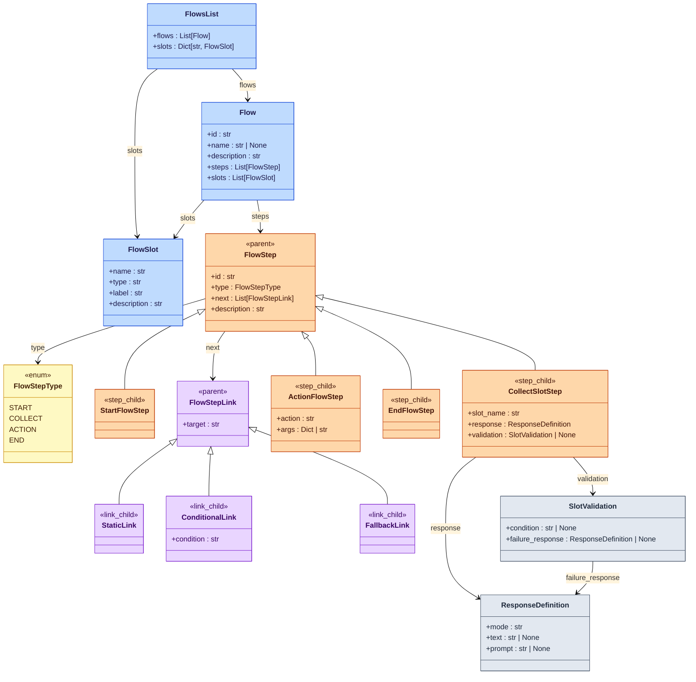

各模型具体定义如下：

`links.py`：

```python
@dataclass(slots=True)
class FlowStepLink:
    target: str


@dataclass(slots=True)
class StaticLink(FlowStepLink):
    pass


@dataclass(slots=True)
class ConditionalLink(FlowStepLink):
    condition: str


@dataclass(slots=True)
class FallbackLink(FlowStepLink):
    pass
```

`steps.py`：

```python
class FlowStepType(str, Enum):
    START = "start"
    ACTION = "action"
    COLLECT = "collect"
    END = "end"


@dataclass(slots=True)
class ResponseDefinition:
    mode: str = "static"
    text: str | None = None
    prompt: str | None = None


@dataclass(slots=True)
class SlotValidation:
    condition: str | None = None
    failure_response: ResponseDefinition | None = None


@dataclass(slots=True)
class FlowStep:
    id: str
    type: FlowStepType
    next: List[FlowStepLink] = field(default_factory=list)
    description: str = ""


@dataclass(slots=True)
class StartFlowStep(FlowStep):
    pass


@dataclass(slots=True)
class ActionFlowStep(FlowStep):
    action: str = ""
    args: Dict[str, Any] = field(default_factory=dict)


@dataclass(slots=True)
class CollectSlotStep(FlowStep):
    slot_name: str = ""
    response: ResponseDefinition = field(default_factory=ResponseDefinition)
    validation: SlotValidation | None = None


@dataclass(slots=True)
class EndFlowStep(FlowStep):
    pass

```

`models.py`：

```python
@dataclass(slots=True)
class FlowSlot:
    name: str
    type: str = "any"
    label: str = ""
    description: str = ""


@dataclass(slots=True)
class Flow:
    id: str
    description: str = ""
    steps: List[FlowStep] = field(default_factory=list)
    slots: List[FlowSlot] = field(default_factory=list)
    name: str | None = None


@dataclass(slots=True)
class FlowsList:
    flows: List[Flow] = field(default_factory=list)
    slots: Dict[str, FlowSlot] = field(default_factory=dict)
```

## 2.2 加载

要求实现一个FlowLoader，支持从多个flow.yaml文件中加载配置，得到FlowsList对象。

# 3. Command定义与解析

## 3.1 模型定义

Command由TurnPlanner调用LLM输出，其具体格式如下：

启动任务：

```json
{"command": "start_flow", "flow": "refund_request"}
```

写入槽位：

```json
{"command": "set_slots", "slots": {"order_number": "10001"}}
```

取消任务：

```json
{"command": "cancel_flow"}
```

恢复任务：

```json
{"command": "resume_task", "flow": "refund_request"}
```

对应的模型定义如下

```python
@dataclass
class Command:
    command: str


@dataclass
class StartFlowCommand(Command):
    flow: str


@dataclass
class SetSlotsCommand(Command):
    slots: dict[str, Any]


@dataclass
class CancelFlowCommand(Command):
    pass


@dataclass
class ResumeTaskCommand(Command):
    flow: str
```

## 3.2 解析

要求能够由LLM输出的JSON格式命令解析为对应的Command对象。

# 4. CommandProcessor

## 4.1 概述

`CommandProcessor` 的职责，就是把 `Command` 应用到 `DialogueState` 上。

`CommandProcessor` 主要修改三类状态：

| 状态 | 说明 |
| --- | --- |
| `active_task` | 当前正在处理的用户任务上下文。 |
| `paused_tasks` | 被打断后暂停的用户任务上下文。 |
| `active_system_flow` | 当前需要优先执行的系统流程上下文。 |

入口方法只做一件事：遍历 commands。

```python
class CommandProcessor:
    def run(
        self,
        commands: list[Command],
        state: DialogueState,
        flows: FlowsList,
    ) -> None:
        for command in commands:
            self._apply(command, state, flows)
```

`_apply()` 根据 Command 类型分发：

```python
def _apply(
    self,
    command: Command,
    state: DialogueState,
    flows: FlowsList,
) -> None:
    if isinstance(command, StartFlowCommand):
        self._handle_start_flow(command, state, flows)
    elif isinstance(command, SetSlotsCommand):
        self._handle_set_slots(command, state)
    elif isinstance(command, CancelFlowCommand):
        self._handle_cancel_flow(state, flows)
    elif isinstance(command, ResumeTaskCommand):
        self._handle_resume_task(command, state, flows)
```

## 4.2 具体处理逻辑

### 4.2.1 start_flow

`start_flow` 表示启动一个业务任务。

```python
StartFlowCommand(command="start_flow", flow="refund_request")
```

处理流程如下：

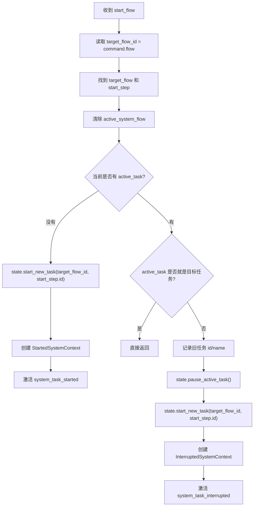

需要的 SystemContext：

```python
@dataclass
class StartedSystemContext(SystemContext):
    started_flow_id: str = ""
    started_flow_name: str = ""


@dataclass
class InterruptedSystemContext(SystemContext):
    interrupted_flow_id: str = ""
    interrupted_flow_name: str = ""
    started_flow_id: str = ""
    started_flow_name: str = ""
```

### 4.2.2 set_slots

`set_slots` 表示用户补充了业务字段。

```python
SetSlotsCommand(
    command="set_slots",
    slots={"order_number": "10001"},
)
```

处理流程如下：

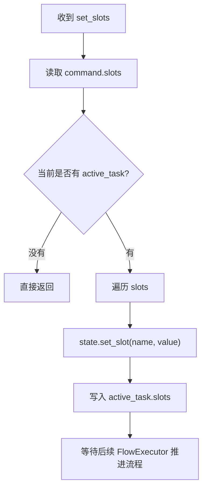

### 4.2.3 cancel_flow

`cancel_flow` 表示取消当前任务。

```python
CancelFlowCommand(command="cancel_flow")
```

处理流程如下：

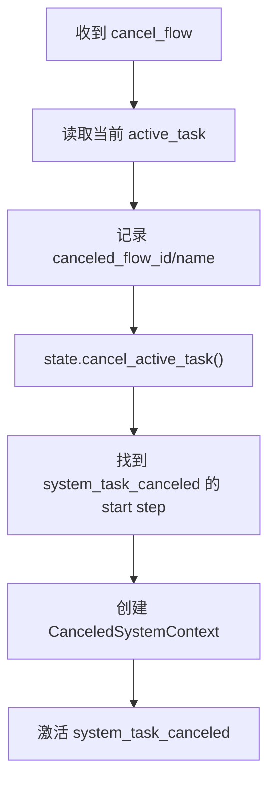

需要的 SystemContext：

```python
@dataclass
class CanceledSystemContext(SystemContext):
    canceled_flow_id: str = ""
    canceled_flow_name: str = ""
```

### 4.2.4 resume_task

`resume_task` 表示恢复指定暂停任务。

```python
ResumeTaskCommand(
    command="resume_task",
    flow="order_status_query",
)
```

处理流程如下：

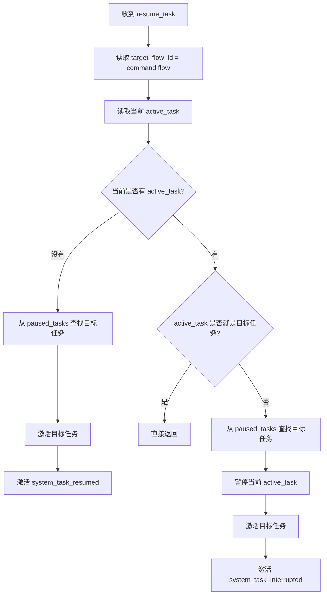

需要的 SystemContext：

```python
@dataclass
class ResumedSystemContext(SystemContext):
    resumed_flow_id: str = ""
    resumed_flow_name: str = ""
```

# 5. ActionRunner

## 5.1 概述

`ActionRunner` 负责执行 flow step 中声明的 action。

它接收 `FlowExecutor` 返回的 `ActionCall`，然后执行对应的动作。

`ActionCall` 的结构如下：

```python
@dataclass
class ActionCall:
    action_name: str
    action_kwargs: dict[str, Any] = field(default_factory=dict)
```

其中：

| 字段            | 说明                   |
| --------------- | ---------------------- |
| `action_name`   | 要执行的 action 名称。 |
| `action_kwargs` | 传给 action 的参数。   |

`ActionRunner` 的整体流程如下：

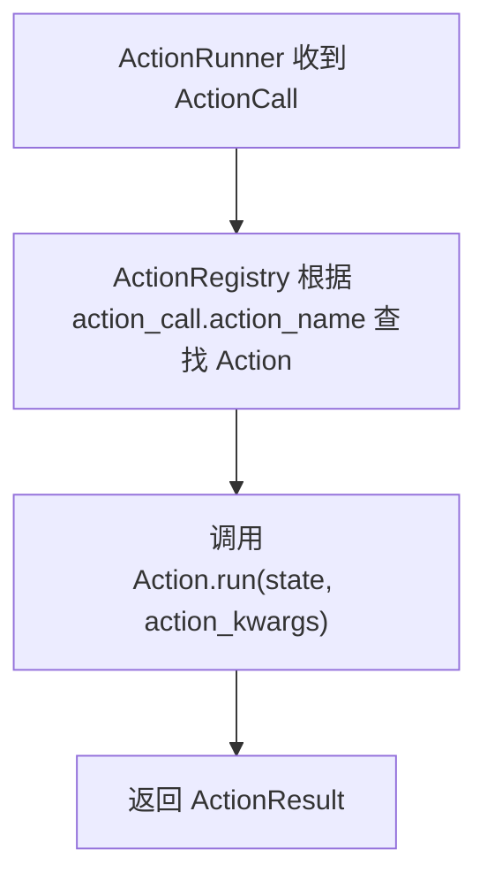

相关概念如下：

| 概念 | 说明 |
| --- | --- |
| `ActionRunner` | action 执行入口。 |
| `ActionRegistry` | action 注册表。 |
| `Action` | 具体动作的基类。 |
| `ActionCall` | 一次 action 调用请求。 |
| `ActionResult` | action 的执行结果。 |

## 5.2 Action

`Action` 是所有运行时动作的基类。

每个 action 都有一个唯一的 `name`。

```python
class Action(ABC):
    name: str

    @abstractmethod
    async def run(
        self,
        state: DialogueState,
        action_kwargs: dict[str, Any],
    ) -> ActionResult:
        pass
```

新增 action 时，只需要继承 `Action`，实现 `run()` 方法，并注册到 `ActionRegistry`。

## 5.3 ActionResult

`ActionResult` 是`Action.run()` 方法返回值类型。

```python
@dataclass
class ActionResult:
    messages: list[BotMessage] = field(default_factory=list)
    slot_updates: dict[str, Any] = field(default_factory=dict)
```

`ActionResult` 包含两类结果：

| 字段 | 说明 |
| --- | --- |
| `messages` | 本次 action 生成的机器人消息。 |
| `slot_updates` | 本次 action 要写回的槽位。 |

## 5.4 ActionRegistry

`ActionRegistry` 是 action 注册表。

它负责维护：

```text
action_name -> Action 实例
```

源码如下：

```python
class ActionRegistry:
    """Resolver for runtime actions."""

    def __init__(self) -> None:
        self._actions: Dict[str, Action] = {}

    def register(self, action: Action) -> None:
        self._actions[action.name] = action

    def get(self, name: str) -> Action:
        if name not in self._actions:
            raise KeyError(f"Unknown action '{name}'.")
        return self._actions[name]
```

方法说明：

| 方法 | 说明 |
| --- | --- |
| `register(action)` | 注册一个 action。 |
| `get(name)` | 根据名称取得 action。 |

使用方式：

```python
registry = ActionRegistry()
registry.register(ActionResponse())
registry.register(ActionListen())
```

`ActionRunner` 执行 action 时，会从 `ActionRegistry` 中查找。

## 5.5 ActionRunner

```python
class ActionRunner:
    """Execute actions requested by the flow executor."""

    def __init__(
        self,
        registry: ActionRegistry,
    ) -> None:
        self.registry = registry

    async def run(
        self,
        action_call: ActionCall,
        state: DialogueState,
    ) -> ActionResult:
        action_name = action_call.action_name
        action = self.registry.get(action_name)
        return await action.run(state, action_call.action_kwargs)
```

`ActionRunner` 不关心 action 的内部逻辑。

它只负责：

| 步骤 | 说明 |
| --- | --- |
| 查找 | 根据 `action_call.action_name` 找到 `Action`。 |
| 执行 | 调用 `Action.run()`。 |
| 返回 | 把 `ActionResult` 交回 `FlowExecutor`。 |

## 5.6 内置 Action

### 5.6.1 action_response

#### 5.6.1.1 概述

`action_response` 用于生成客服回复。

它读取 flow step 中的 `args`，结合当前 `DialogueState`，最终返回一个包含 `BotMessage` 的 `ActionResult`。

```yaml
type: action
action: action_response
args:
  mode: static
  text: "订单{{ slots.order_number }}正在配送中。"
```

整体过程如下：

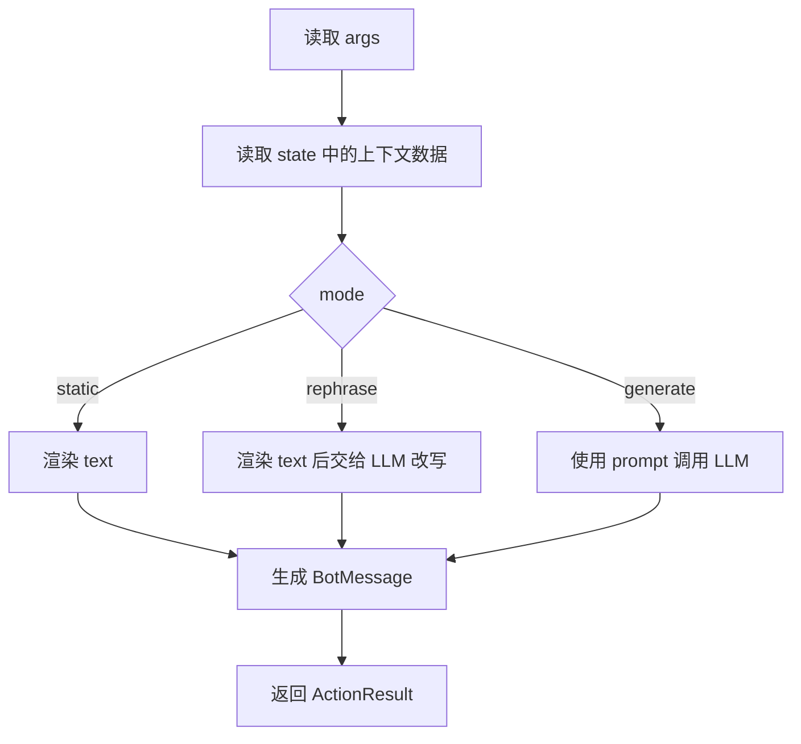

最终返回：

```python
ActionResult(messages=[BotMessage(text=result)])
```

#### 5.6.1.2 参数说明

`action_response` 主要读取三个参数：

| 参数 | 说明 |
| --- | --- |
| `mode` | 回复生成模式。 |
| `text` | 回复文本模板。 |
| `prompt` | LLM 指令模板。 |

##### 5.6.1.2.1 mode

`mode` 决定回复如何生成。

| mode | 说明 |
| --- | --- |
| `static` | 只渲染 `text`，不调用 LLM。 |
| `rephrase` | 先渲染 `text`，再让 LLM 改写。 |
| `generate` | 直接使用 `prompt` 让 LLM 生成。 |

`static` 示例：

```yaml
type: action
action: action_response
args:
  mode: static
  text: "订单{{ slots.order_number }}当前状态是{{ slots.order_status }}我会继续帮你跟进。"
```

`rephrase` 示例：

```yaml
type: action
action: action_response
args:
  mode: rephrase
  text: "订单{{ slots.order_number }}的退款申请已经提交。"
  prompt: |
    你是一个中文电商客服助手，语气自然、友好、简洁。
    请结合对话上下文，把下面的建议回复改写得更自然，但不要改变含义。

    对话历史：
    {{ history }}

    用户最后一句：
    {{ user_message }}

    建议回复：{{ current_response }}
```

`generate` 示例：

```yaml
type: action
action: action_response
args:
  mode: generate
  prompt: |
    你是一个中文电商客服助手，语气自然、友好、简洁。
    请根据对话上下文和用户最后一句，生成一句客服回复。

    对话历史：{{ history }}

    用户最后一句：{{ user_message }}
```

##### 5.6.1.2.2 text

`text` 是回复文本模板。

它用于生成最终可能展示给用户的回复。

在 `static` 模式下，`text` 渲染后的结果就是最终回复。

在 `rephrase` 模式下，`text` 会先被渲染成 `current_response`，再交给 LLM 改写。

`text` 支持 Jinja2 模板渲染。

常用参数：

| 参数 | 说明 |
| --- | --- |
| `slots` | 当前业务任务槽位。 |
| `context` | 当前系统流程上下文。 |

示例：

```yaml
text: "订单{{ slots.order_number }}当前状态是：{{ slots.order_status }}。"
```

如果运行时数据是：

```python
slots = {
    "order_number": "10001",
    "order_status": "配送中",
}
```

渲染结果是：

```text
订单10001当前状态是：配送中。
```

##### 5.6.1.2.3 prompt

`prompt` 是给 LLM 使用的指令模板。

它不直接展示给用户，而是作为模型输入的一部分。

在 `rephrase` 模式下，`prompt` 用于改写已经渲染好的 `text`。

在 `generate` 模式下，`prompt` 用于直接生成最终回复。

`prompt` 也支持 Jinja2 模板渲染。

常用参数：

| 参数 | 说明 |
| --- | --- |
| `history` | 当前会话历史。 |
| `user_message` | 当前用户消息。 |
| `current_response` | 已渲染好的建议回复，主要用于 `rephrase`。 |

示例：

```yaml
prompt: |
  你是一个中文电商客服助手，语气自然、友好、简洁。
  请基于下面的建议回复，生成一句更自然的中文回复。

  对话上下文：
  {{ history }}

  用户最后一句：
  {{ user_message }}

  建议回复：
  {{ current_response }}
```

#### 5.6.1.3 Jinja2 参考

##### 5.6.1.3.1 概述

Jinja2 是 Python 中常用的模板引擎。

模板引擎用于把模板和数据合成为最终文本：

```text
模板 + 数据 -> 文本
```

##### 5.6.1.3.2 模板语法

###### 5.6.1.3.2.1 变量

变量输出使用 `{{ ... }}`。

```jinja2
你好，{{ name }}
```

传入：

```python
{"name": "小明"}
```

输出：

```text
你好，小明
```

如果变量值为字典或者对象，还可通过`.` 访问其中的字段，例如：

```jinja2
订单{{ slots.order_number }}正在配送中。
```

传入：

```python
{
    "slots": {
        "order_number": "10001"
    }
}
```

输出：

```text
订单10001正在配送中。
```

###### 5.6.1.3.2.2 条件块

条件块使用 `` 和 ``。

```jinja2

对话历史：
{{ history }}

```

如果 `history` 有值，中间内容会输出。

如果 `history` 为空，中间内容不会输出。

##### 5.6.1.3.3 渲染工具

###### 5.6.1.3.3.1 原生 Jinja2

使用 pip 安装：


```bash
pip install jinja2
```

原生用法直接使用 `jinja2.Template`。

```python
from jinja2 import Template

template = Template("订单{{ order_number }}正在配送中。")
result = template.render(order_number="10001")
```

渲染结果：

```text
订单10001正在配送中。
```

###### 5.6.1.3.3.2 LangChain PromptTemplate

`langchain` 中的 `PromptTemplate` 也支持 Jinja2 模板。

```python
from langchain_core.prompts import PromptTemplate

prompt = PromptTemplate.from_template(
    prompt_text,
    template_format="jinja2",
)
```

执行时传入变量：

```python
prompt_inputs = {
    "history": transcript,
    "current_response": current_response,
    "user_message": user_message,
}

chain = prompt | llm | output_parser
result = await chain.ainvoke(prompt_inputs)
```

### 5.6.2 action_listen

`action_listen` 表示流程暂停，等待下一轮用户输入。

它通常不真正生成消息，只作为 `FlowExecutor` 的停止信号。

## 5.7 自定义Action

自定义action，需要根据具体的工作流配置自行定义。

## 5.8 ActionRunner Builder

`build_action_runner()` 负责组装 `ActionRunner`。

它会创建 `ActionRegistry`，再把内置 action 和自定义 action 注册进去。

源码如下：

```python
def build_action_runner(
        llm: Any | None = None,
        include_custom_actions: bool = True,
) -> ActionRunner:
    action_runner = ActionRunner(ActionRegistry())
    register_builtin_actions(action_runner, llm=llm)
    if include_custom_actions:
        register_custom_actions(action_runner)
    return action_runner
```

注册Action的具体逻辑如下：

### 5.8.1 内置 Action 注册

内置 action 由 `register_builtin_actions()` 注册。

源码如下：

```python
def register_builtin_actions(
    action_runner: ActionRunner,
    llm: Any | None = None,
) -> ActionRunner:
    for action in (
        ActionListen(),
        ActionResponse(llm=llm),
    ):
        action_runner.registry.register(action)
    return action_runner
```

这里会注册两个内置 action：

| action           | 说明                 |
| ---------------- | -------------------- |
| `ActionListen`   | 等待下一轮用户输入。 |
| `ActionResponse` | 生成客服回复。       |

### 5.8.2 自定义 Action 注册

自定义 action 由 `register_custom_actions()` 自动扫描并注册。

源码如下：

```python
def register_custom_actions(
    action_runner: ActionRunner,
    package_name: str = "atguigu.task.actions.custom",
) -> ActionRunner:
    package = importlib.import_module(package_name)

    for _, module_name, is_pkg in pkgutil.iter_modules(package.__path__, prefix=f"{package.__name__}."):
        if is_pkg:
            continue
        module = importlib.import_module(module_name)
        for action in _discover_actions(module):
            action_runner.registry.register(action)

    return action_runner
```

`_discover_actions()` 负责从模块中找出真正的 action 类：

```python
def _discover_actions(module: ModuleType) -> list[Action]:
    actions: list[Action] = []
    for _, obj in inspect.getmembers(module, inspect.isclass):
        if not issubclass(obj, Action) or obj is Action:
            continue
        if obj.__module__ != module.__name__:
            continue
        actions.append(obj())
    actions.sort(key=lambda action: action.name)
    return actions
```

注册逻辑如下：

1. 导入 `atguigu.task.actions.custom` 包。
2. 扫描包下面的 Python 模块。
3. 跳过子包。
4. 从模块中找出继承自 `Action` 的类。
5. 实例化 action，并注册到 `ActionRunner.registry`。

#### 5.8.2.1 技术参考

自定义 Action 注册用到了 Python 的动态导入、包扫描和类检查能力。

这些能力常用于插件系统、自动注册、命令发现、任务发现等场景。

##### 5.8.2.1.1 包和模块

在 Python 中，`.py` 文件通常称为模块。

包含 `__init__.py` 的目录通常称为包。

例如：

```text
my_app/
  plugins/
    __init__.py
    send_email.py
    export_file.py
```

这里：

| 名称 | 含义 |
| --- | --- |
| `plugins` | 包。 |
| `send_email.py` | 模块。 |
| `export_file.py` | 模块。 |

如果要导入 `send_email.py`，完整模块名通常是：

```python
my_app.plugins.send_email
```

##### 5.8.2.1.2 动态导入

普通导入是在代码里直接写：

```python
import my_app.plugins.send_email
```

动态导入是在运行时根据字符串导入模块：

```python
import importlib

module = importlib.import_module("my_app.plugins.send_email")
```

动态导入适合这种场景：

```python
module_name = "my_app.plugins.send_email"
module = importlib.import_module(module_name)
```

也就是说，模块名可以来自配置、扫描结果或用户输入。

##### 5.8.2.1.3 包扫描

`pkgutil.iter_modules()` 可以扫描某个包下面有哪些模块。

示例：

```python
import importlib
import pkgutil

package = importlib.import_module("my_app.plugins")

for finder, module_name, is_pkg in pkgutil.iter_modules(package.__path__):
    print(finder, module_name, is_pkg)
```

`pkgutil.iter_modules()` 每次返回三个字段：

| 字段 | 说明 |
| --- | --- |
| `finder` | 模块查找器。它知道如何在指定路径中找到并加载模块。 |
| `module_name` | 模块名。如果没有传 `prefix`，通常只是短名称，例如 `send_email`。 |
| `is_pkg` | 当前项是否为包。`True` 表示它是子包，`False` 表示它是普通模块。 |

例如扫描结果可能是：

```text
finder=<FileFinder ...>, module_name="send_email", is_pkg=False
finder=<FileFinder ...>, module_name="admin", is_pkg=True
```

如果使用 `prefix`，扫描结果会直接带上完整模块名前缀：

```python
for _, module_name, is_pkg in pkgutil.iter_modules(
    package.__path__,
    prefix=f"{package.__name__}.",
):
    print(module_name)
```

输出可能是：

```text
my_app.plugins.send_email
my_app.plugins.export_file
```

这里的 `_` 表示忽略第一个返回值 `finder`。

在自动注册场景中，常见处理方式是：

| 字段 | 常见用法 |
| --- | --- |
| `finder` | 通常不用，所以写成 `_`。 |
| `module_name` | 传给 `importlib.import_module()` 动态导入模块。 |
| `is_pkg` | 用来跳过子包，只处理普通 `.py` 模块。 |

##### 5.8.2.1.4 查看模块成员

模块导入后，可以用 `inspect.getmembers()` 查看模块中定义了哪些对象。

例如：

```python
import inspect

for name, obj in inspect.getmembers(module):
    print(name, obj)
```

`inspect.getmembers()` 每次返回两个字段：

| 字段 | 说明 |
| --- | --- |
| `name` | 成员名称，类型是字符串。例如类名、函数名、变量名。 |
| `obj` | 成员对象本身。它可能是类、函数、变量、模块等任意对象。 |

例如一个模块中有：

```python
VERSION = "1.0"

def hello():
    pass

class SendEmailPlugin:
    pass
```

扫描结果中可能包含：

```text
name="VERSION", obj="1.0"
name="hello", obj=<function hello>
name="SendEmailPlugin", obj=<class SendEmailPlugin>
```

如果只想找类，可以配合 `inspect.isclass`：

```python
for name, obj in inspect.getmembers(module, inspect.isclass):
    print(name, obj)
```

第二个参数 `inspect.isclass` 是一个过滤条件。只有让这个条件返回 `True` 的成员，才会出现在结果中。

因此这段代码只会返回类：

```text
name="SendEmailPlugin", obj=<class SendEmailPlugin>
```

在自动注册场景中，常见处理方式是：

| 字段 | 常见用法 |
| --- | --- |
| `name` | 通常只用于调试或日志。 |
| `obj` | 用来判断是否继承指定基类，并在通过后实例化。 |

##### 5.8.2.1.5 判断继承关系

`issubclass()` 用于判断一个类是否继承自另一个类。

示例：

```python
class Base:
    pass

class Child(Base):
    pass

issubclass(Child, Base)  # True
```

扫描插件类时，常见写法是：

```python
if issubclass(obj, BasePlugin) and obj is not BasePlugin:
    plugins.append(obj())
```

这里要排除 `BasePlugin` 本身，因为它只是基类，不是真正要运行的插件。

##### 5.8.2.1.6 `__module__`

每个类都有 `__module__` 属性，用来表示这个类定义在哪个模块里。

例如：

```python
print(MyPlugin.__module__)
```

如果当前模块名是：

```python
my_app.plugins.send_email
```

那么在这个模块中定义的类，通常有：

```python
MyPlugin.__module__ == "my_app.plugins.send_email"
```

扫描类时常用这个判断：

```python
if obj.__module__ != module.__name__:
    continue
```

它的作用是：只注册当前模块中定义的类，跳过从其他模块导入进来的类。

##### 5.8.2.1.7 自动注册的一般流程

自动注册通常可以分成五步：

```text
导入包
  -> 扫描包下面的模块
  -> 动态导入每个模块
  -> 找出符合条件的类
  -> 实例化并注册
```

对应到通用代码：

```python
package = importlib.import_module("my_app.plugins")

for _, module_name, is_pkg in pkgutil.iter_modules(package.__path__, prefix=f"{package.__name__}."):
    if is_pkg:
        continue

    module = importlib.import_module(module_name)

    for _, obj in inspect.getmembers(module, inspect.isclass):
        if not issubclass(obj, BasePlugin) or obj is BasePlugin:
            continue
        if obj.__module__ != module.__name__:
            continue

        registry.register(obj())
```

这类代码的核心思想是：新增功能类时，只要把类放进约定的包里，并继承约定的基类，系统就能自动发现并注册它。

# 6. FlowExecutor

## 6.1 概述

`FlowExecutor` 负责推进当前流程。

它的核心思路是：

```text
先推进 flow，直到遇到 action；
再执行 action；
执行完 action 后继续推进 flow；
直到系统需要等待用户输入。
```

`FlowExecutor` 主要由两个方法协作完成：

| 方法 | 作用 |
| --- | --- |
| `run_task()` | 外层循环，负责执行 `ActionCall` 并收集消息。 |
| `advance_until_action()` | 内层循环，持续推进 flow，直到拿到下一个 `ActionCall`。 |

`run_task()` 控制外层循环：

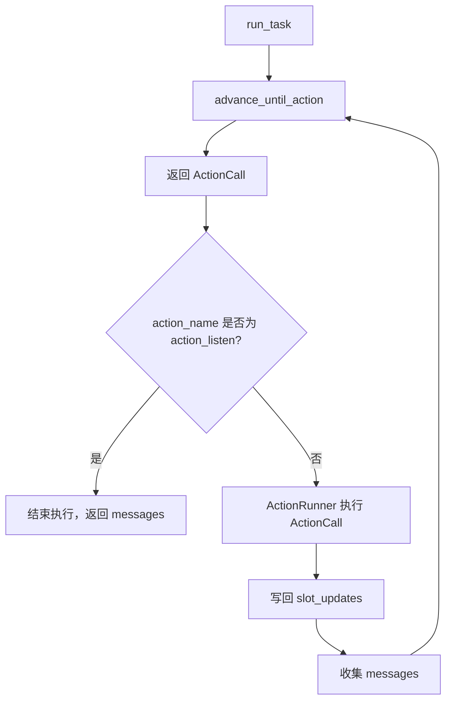

`advance_until_action()` 控制 flow 内部推进：

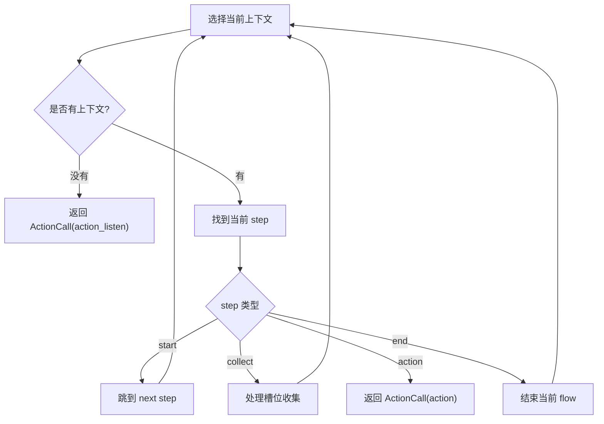

task执行优先级如下：

```text
active_system_task > active_task
```

## 6.2 run_task

`run_task()` 负责控制外层执行循环。

源码如下：

```python
async def run_task(
    self,
    state: DialogueState,
    flows: FlowsList,
    action_runner: ActionRunner,
    max_steps: int = 1000,
) -> List[BotMessage]:
    """循环推进 flow 并执行 action，直到等待用户输入为止。"""
    messages: List[BotMessage] = []
    step_count = 0

    while True:
        action_call = await self.advance_until_action(state, flows)
        if action_call.action_name == "action_listen":
            break

        action_result = await action_runner.run(action_call, state)

        for slot_name, value in action_result.slot_updates.items():
            state.set_slot(slot_name, value)
        messages.extend(action_result.messages)

        step_count += 1
        if step_count >= max_steps:
            raise RuntimeError(
                f"Flow execution exceeded {max_steps} steps."
            )

    return messages
```

核心逻辑：

1. 调用 `advance_until_action()` 找到下一个要执行的 action。
2. 如果 action 是 `action_listen`，说明需要等待用户输入，循环结束。
3. 否则交给 `ActionRunner` 执行 action。
4. action 执行后，写回 `slot_updates`，收集 `messages`。
5. 最终返回本轮任务轨道生成的所有 `BotMessage`。

## 6.3 advance_until_action

### 6.3.1 概述

`advance_until_action()` 会持续推进 flow，直到遇到一个需要执行的 action。

它每轮先选择当前上下文：

| 状态 | 当前上下文 |
| --- | --- |
| 有 `active_system_flow` | 使用系统流程上下文。 |
| 无系统流程，但有 `active_task` | 使用业务任务上下文。 |
| 都没有 | 返回 `ActionCall("action_listen")`。 |

选择上下文的流程如下：

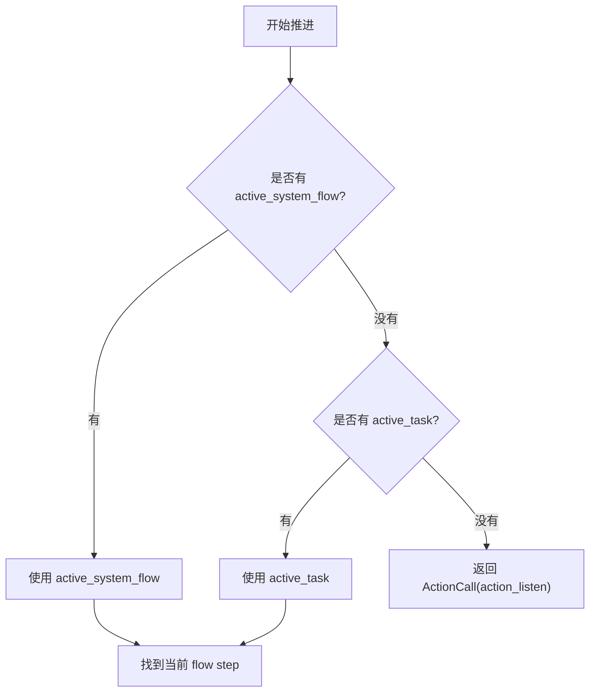

找到当前上下文后，它会找到当前 step，并交给 `_run_step()` 处理。

`_run_step()` 根据 step 类型分发：

```python
def _run_step(
    self,
    step: FlowStep,
    flow: Flow,
    state: DialogueState,
    flows: FlowsList,
    ctx: object,
    context_data: dict[str, Any],
) -> ActionCall | None:
    if isinstance(step, StartFlowStep):
        return self._run_start_step(step, flow, state, ctx, context_data)

    if isinstance(step, CollectSlotStep):
        return self._run_collect_step(step, flow, state, flows, ctx, context_data)

    if isinstance(step, ActionFlowStep):
        return self._run_action_step(step, flow, state, ctx, context_data)

    if isinstance(step, EndFlowStep):
        return self._run_end_step(state)
```

### 6.3.2 start step

`start` step 不执行 action，只负责进入真正的业务节点。

处理流程：

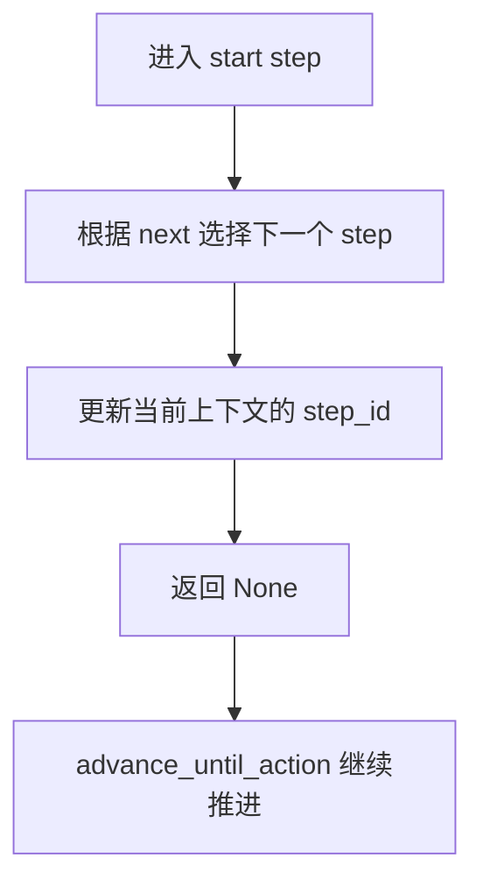

对应逻辑：

```python
def _run_start_step(...) -> ActionCall | None:
    self._advance_to_next_step(step, flow, state, ctx, context_data)
    return None
```

### 6.3.3 collect step

`collect` step 用于收集槽位。

处理流程：

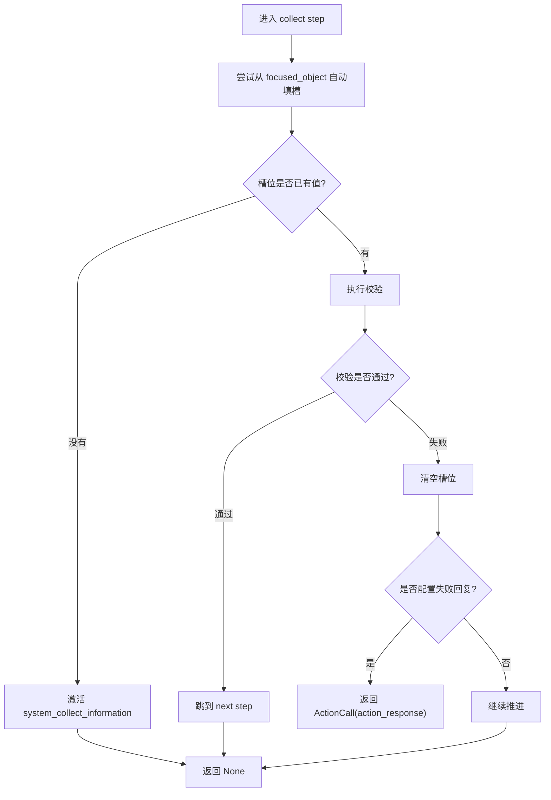

如果槽位缺失，会激活系统流程：

```python
CollectSystemContext(
    slot_name=step.slot_name,
    response={
        "mode": step.response.mode,
        "text": step.response.text,
        "prompt": step.response.prompt,
    },
)
```

如果槽位已有值，会先执行校验。校验失败时会清空槽位；如果配置了失败回复，则返回 `ActionCall("action_response")`。

### 6.3.4 action step

`action` step 会构造 `ActionCall`，交给 `run_task()` 执行。

处理流程：

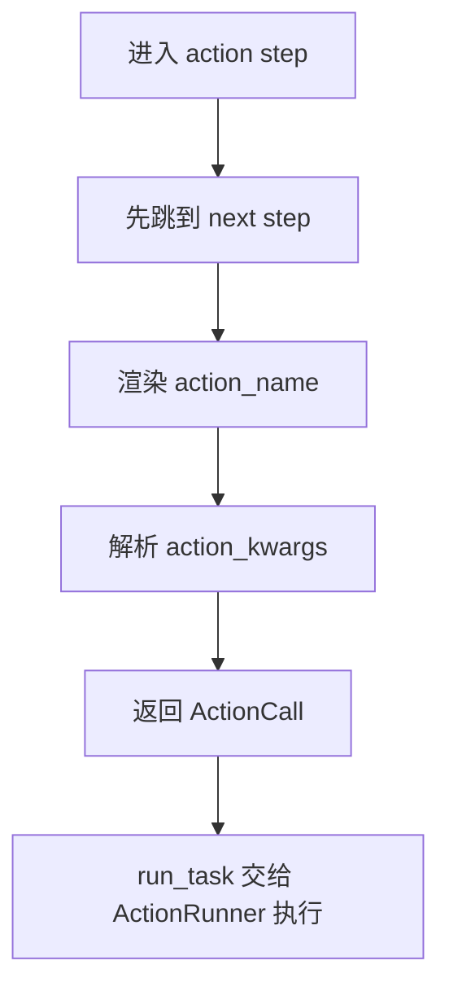

`ActionCall` 的结构如下：

```python
ActionCall(
    action_name=action_name,
    action_kwargs=args,
)
```

`args` 只支持两种配置方式。

第一种是直接配置字典：

```yaml
args:
  mode: static
  text: "请告诉我你的订单号。"
```

第二种是整体引用当前 context 中的字典属性：

```yaml
args: context.response
```

对应源码如下：

```python
@classmethod
def _resolve_action_args(
    cls,
    raw_args: dict[str, Any] | str,
    context: dict[str, Any],
) -> dict[str, Any]:
    if isinstance(raw_args, str):
        return cls._resolve_context_reference(raw_args, context)
    return raw_args

@staticmethod
def _resolve_context_reference(
    reference: str,
    context: dict[str, Any],
) -> dict[str, Any]:
    field_name = reference.strip().removeprefix("context.")
    return context[field_name]
```

### 6.3.5 end step

`end` step 表示当前流程结束。

处理流程：

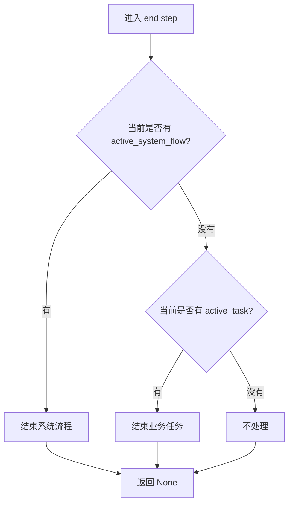

处理规则如下：

| 当前状态 | 处理 |
| --- | --- |
| 有 `active_system_flow` | 结束系统流程。 |
| 有 `active_task` | 结束业务任务。 |
| 都没有 | 不处理。 |

# 7. TaskHandler

`TaskHandler` 是任务轨道的总入口。

源码如下：

```python
class TaskHandler:
    def __init__(
        self,
        flows: FlowsList,
        command_processor: CommandProcessor,
        flow_executor: FlowExecutor,
        action_runner: ActionRunner,
        max_steps: int = 1000,
    ) -> None:
        self.flows = flows
        self.command_processor = command_processor
        self.flow_executor = flow_executor
        self.action_runner = action_runner
        self.max_steps = max_steps

    async def handle(
        self,
        commands: List[Command],
        state: DialogueState,
    ) -> None:
        if state.pending_turn is None:
            raise ValueError("No pending turn available for task handling.")

        if commands:
            self.command_processor.run(commands, state, self.flows)

        messages = await self.flow_executor.run_task(
            state, self.flows, self.action_runner,
            max_steps=self.max_steps,
        )
        state.pending_turn.assistant_messages.extend(messages)
```

简要说明：

1. `TaskHandler` 通过构造函数接收 `CommandProcessor`、`FlowExecutor` 和 `ActionRunner`。
2. `handle()` 先确认当前轮次存在 `pending_turn`。
3. 如果有 commands，先交给 `CommandProcessor` 修改 `DialogueState`。
4. 然后调用 `FlowExecutor.run_task()` 推进 flow，并执行过程中遇到的 action。
5. 最后把生成的 `BotMessage` 写入 `pending_turn.assistant_messages`。
