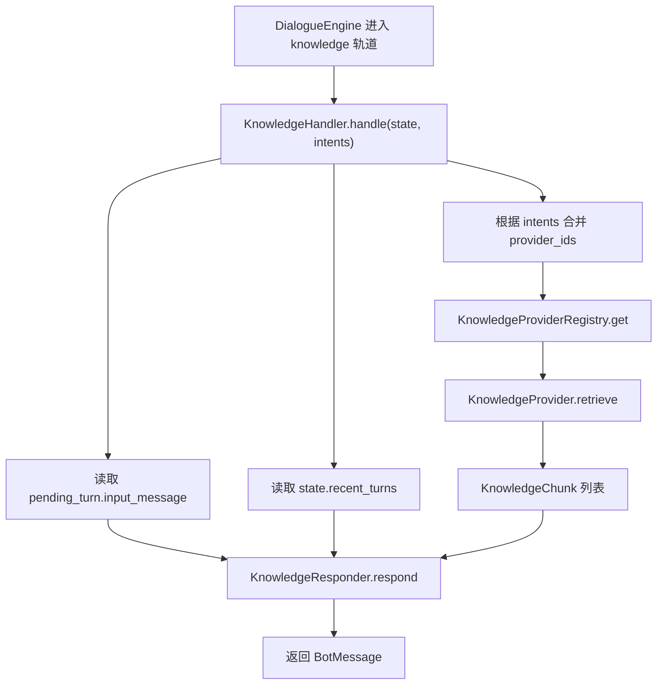
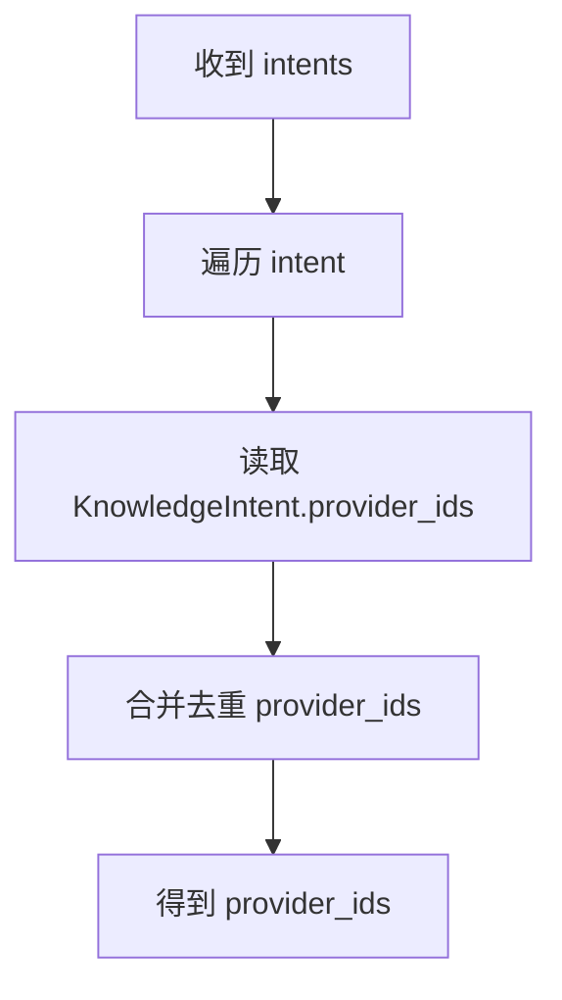
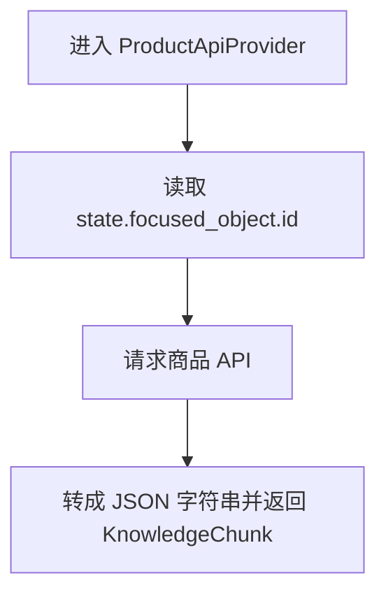
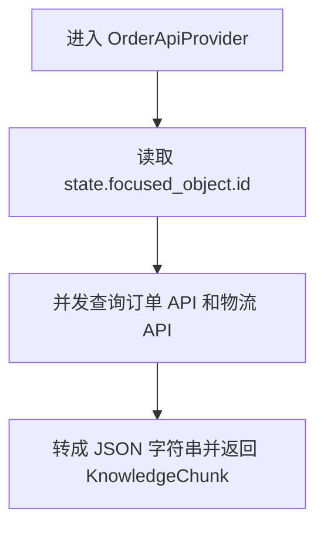
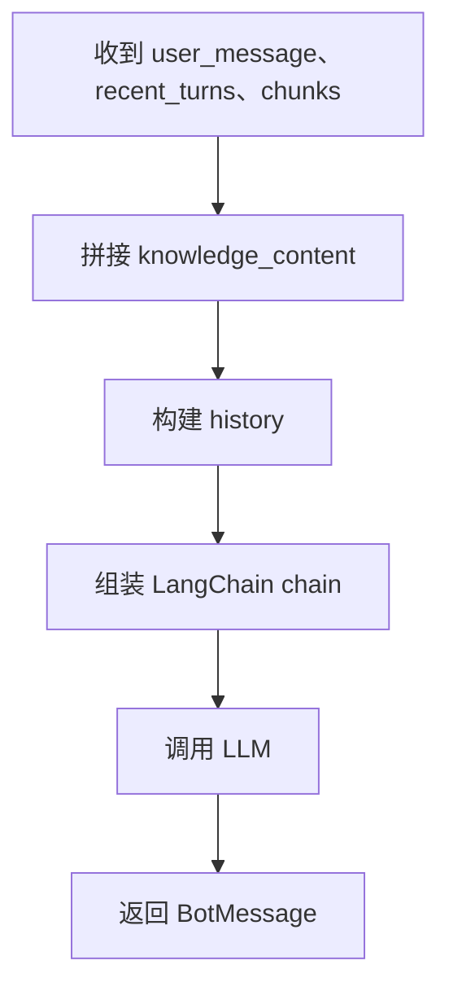

# 1. KnowledgeHandler 概述

`KnowledgeHandler` 负责处理知识问答类请求。

它的入口方法是 `handle()`，接收两个参数：

| 参数 | 说明 |
| --- | --- |
| `state` | 当前完整对话状态，包含当前 turn、历史对话、聚焦对象等信息。 |
| `intents` | 本轮命中的知识意图列表，例如 `product_info`、`return_policy`。 |

整体流程如下：



核心对象如下：

| 对象 | 作用 |
| --- | --- |
| `KnowledgeHandler` | 知识问答入口，负责编排完整流程。 |
| `KnowledgeIntent` | 描述知识意图及其需要的 provider。 |
| `KnowledgeChunk` | provider 返回的知识片段。 |
| `KnowledgeProvider` | 从某个知识来源返回知识片段。 |
| `KnowledgeResponder` | 根据用户问题、对话历史和知识片段生成最终回复。 |

# 2. KnowledgeIntent

`KnowledgeIntent` 描述一种知识问答意图，以及这个意图需要查询哪些 provider。

完整代码如下：

```python
from dataclasses import dataclass, field


@dataclass
class KnowledgeIntent:
    id: str
    description: str
    provider_ids: list[str] = field(default_factory=list)
    requires_object: str | None = None


KNOWLEDGE_INTENTS: dict[str, KnowledgeIntent] = {
    "product_info": KnowledgeIntent(
        id="product_info",
        description="商品信息咨询",
        provider_ids=["api.product"],
        requires_object="product",
    ),
    "order_info": KnowledgeIntent(
        id="order_info",
        description="订单信息咨询",
        provider_ids=["api.order"],
        requires_object="order",
    ),
    "refund_policy": KnowledgeIntent(
        id="refund_policy",
        description="退款政策咨询",
        provider_ids=["faq.default", "rag.default"],
    ),
    "return_policy": KnowledgeIntent(
        id="return_policy",
        description="退货政策咨询",
        provider_ids=["faq.default", "rag.default"],
    ),
    "shipping_policy": KnowledgeIntent(
        id="shipping_policy",
        description="配送政策咨询",
        provider_ids=["faq.default", "rag.default"],
    ),
    "platform_rule": KnowledgeIntent(
        id="platform_rule",
        description="平台规则咨询",
        provider_ids=["rag.default", "rag.default"],
    ),
    "general_ecommerce_info": KnowledgeIntent(
        id="general_ecommerce_info",
        description="电商通用信息咨询",
        provider_ids=["faq.default", "rag.default"],
    ),
}
```

字段说明：

| 字段 | 说明 |
| --- | --- |
| `id` | 知识意图 ID。 |
| `description` | 意图说明。 |
| `provider_ids` | 该意图需要查询的 provider。 |
| `requires_object` | 是否要求当前有聚焦对象。 |

当前系统中的知识意图包括：

| 意图 | provider | 聚焦对象 |
| --- | --- | --- |
| `product_info` | `api.product` | `product` |
| `order_info` | `api.order` | `order` |
| `refund_policy` | `faq.default`, `rag.default` | 无 |
| `return_policy` | `faq.default`, `rag.default` | 无 |
| `shipping_policy` | `faq.default`, `rag.default` | 无 |
| `platform_rule` | `rag.default`, `rag.default` | 无 |
| `general_ecommerce_info` | `faq.default`, `rag.default` | 无 |

`KnowledgeHandler` 会根据 `intents` 确定所需的 `provider`：



# 3. KnowledgeProvider

## 3.1 概述

`KnowledgeProvider` 表示一个知识来源。

当前项目把知识来源分为三类：

| 类型 | 说明 |
| --- | --- |
| API | 查询实时业务数据，例如商品和订单。 |
| FAQ | 标准问答。 |
| RAG | 文档知识库检索。 |

`KnowledgeProvider` 是知识来源的基类。

每个 provider 负责根据当前 `DialogueState` 检索知识，并返回 `KnowledgeChunk` 列表。

`KnowledgeProvider` 的源码如下：

```python
class KnowledgeProvider:
    provider_id = ""

    async def retrieve(
        self,
        state: DialogueState,
    ) -> list[KnowledgeChunk]:
        return []
```

`provider_id` 是 provider 的唯一 ID，用于注册和查找，例如 `api.product`、`api.order`。

`retrieve(state)` 是 provider 的核心方法。它从 `state` 中读取所需信息，并返回本次检索到的知识片段，也就是 `list[KnowledgeChunk]`。

`KnowledgeChunk` 的源码如下：

```python
@dataclass
class KnowledgeChunk:
    content: str
```

## 3.2 ProductApiProvider

`ProductApiProvider` 查询商品实时信息。

核心逻辑如下：

```python
class ProductApiProvider(KnowledgeProvider):
    provider_id = "api.product"

    async def retrieve(
        self,
        state: DialogueState,
    ) -> list[KnowledgeChunk]:
        focused_object = state.focused_object
        product_id = focused_object.id

        payload = await self._fetch(product_id)

        return [
            KnowledgeChunk(
                content="商品信息：\n"
                + json.dumps(payload, ensure_ascii=False, indent=2)
            )
        ]
```

处理流程如下：



## 3.3 OrderApiProvider

`OrderApiProvider` 查询订单和物流实时信息。

核心逻辑如下：

```python
class OrderApiProvider(KnowledgeProvider):
    provider_id = "api.order"

    async def retrieve(
        self,
        state: DialogueState,
    ) -> list[KnowledgeChunk]:
        focused_object = state.focused_object
        order_number = focused_object.id

        order_payload, logistics_payload = await asyncio.gather(
            self._fetch_order(order_number),
            self._fetch_logistics(order_number),
        )

        return [
            KnowledgeChunk(
                content="订单与物流信息：\n"
                + json.dumps(
                    {
                        "order_number": order_number,
                        "order": order_payload,
                        "logistics": logistics_payload,
                    },
                    ensure_ascii=False,
                    indent=2,
                )
            )
        ]
```

处理流程如下：



这里使用 `asyncio.gather()` 同时请求订单和物流接口，减少等待时间。

## 3.4 FAQ 和 RAG Provider

当前 `FaqKnowledgeProvider` 和 `RagKnowledgeProvider` 是占位实现。

源码如下：

```python
class FaqKnowledgeProvider(KnowledgeProvider):
    provider_id = "faq.default"


class RagKnowledgeProvider(KnowledgeProvider):
    provider_id = "rag.default"
```

# 4. KnowledgeProviderRegistry

`KnowledgeProviderRegistry` 用来根据 provider id 查找 provider。

源码如下：

```python
class KnowledgeProviderRegistry:
    def __init__(self, providers: list[KnowledgeProvider]) -> None:
        self._providers_by_id = {p.provider_id: p for p in providers}

    def get(self, provider_id: str) -> KnowledgeProvider:
        return self._providers_by_id[provider_id]
```

它把 provider 列表转换为字典：

```text
provider_id -> provider 实例
```

# 5. KnowledgeResponder

`KnowledgeResponder` 负责把知识片段、对话历史和用户问题交给大模型，生成最终客服回复。其核心方法签名如下：

```python
class KnowledgeResponder:
    async def respond(
        self,
        user_message: str,
        recent_turns: list[Turn],
        chunks: list[KnowledgeChunk],
    ) -> list[BotMessage]:
        ...
```

处理流程如下：


调用 LLM 的提示词如下：

```jinja2
你是一个中文电商客服助手，语气自然、友好、简洁。

以下是与用户问题相关的商品或业务信息，请优先基于这些内容作答：
{{ knowledge_content }}

要求：
- 只根据已知信息作答，不要编造不存在的内容。
- 如果信息不足，坦诚告知并引导用户提供更多细节。
- 语气自然，不要机械复述资料原文。

对话历史：
{{ history }}

用户当前问题：{{ user_message }}

助手回复：
```

涉及到的变量有：

| 变量 | 来源 |
| --- | --- |
| `knowledge_content` | provider 返回的知识片段。 |
| `history` | 最近对话历史。 |
| `user_message` | 当前用户问题。 |

# 6. KnowledgeHandler

`KnowledgeHandler` 是知识问答流程的总入口。

源码如下：

```python
class KnowledgeHandler:
    def __init__(
        self,
        knowledge_intents: dict[str, KnowledgeIntent],
        responder: KnowledgeResponder,
        registry: KnowledgeProviderRegistry,
    ) -> None:
        self.knowledge_intents = knowledge_intents
        self.responder = responder
        self.registry = registry

    async def handle(
        self,
        state: DialogueState,
        intents: list[str],
    ) -> list[BotMessage]:
        pending_turn = state.pending_turn

        user_message = (pending_turn.input_message.text or "").strip()
        recent_turns = state.recent_turns(10)

        provider_ids = self._provider_ids_for_intents(intents)
        chunks = []
        for provider_id in provider_ids:
            provider = self.registry.get(provider_id)
            chunks.extend(await provider.retrieve(state))
        return await self.responder.respond(user_message, recent_turns, chunks)

    def _provider_ids_for_intents(self, intents: list[str]) -> list[str]:
        provider_ids = []
        for intent in intents:
            intent_meta = self.knowledge_intents[intent]
            for provider_id in intent_meta.provider_ids:
                if provider_id not in provider_ids:
                    provider_ids.append(provider_id)
        return provider_ids
```

处理步骤如下：

1. 从 `state.pending_turn.input_message` 读取当前用户问题。
2. 从 `state.recent_turns(10)` 读取最近对话历史。
3. 根据 `intents` 合并 provider 列表。
4. 调用 `provider.retrieve(state)` 获取知识片段。
5. 调用 `responder.respond(user_message, recent_turns, chunks)` 生成回复。
