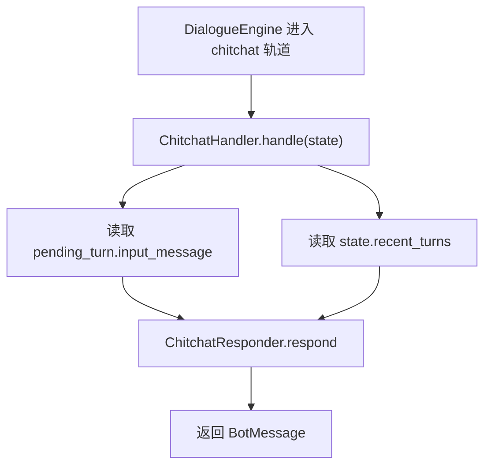
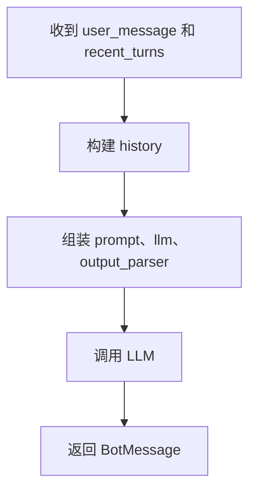

# 1. 概述

`ChitChatHandler` 负责处理闲聊类请求。

整体流程如下：



核心对象如下：

| 对象 | 作用 |
| --- | --- |
| `ChitchatHandler` | 闲聊轨道入口。 |
| `ChitchatResponder` | 调用 LLM 生成闲聊回复。 |
| `chitchat/response` | 闲聊提示词。 |

# 2. ChitChatHandler

`ChitchatHandler` 是闲聊轨道的入口。

完整代码如下：

```python
class ChitchatHandler:
    def __init__(
            self,
            responder: ChitchatResponder
    ) -> None:
        self.responder = responder

    async def handle(self, state: DialogueState) -> list[BotMessage]:
        pending_turn = state.pending_turn
        user_message = pending_turn.user_message
        recent_turns = state.current_session().turns
        return await self.responder.respond(
            user_message=user_message,
            recent_turns=recent_turns,
        )
```

# 3. ChitChatResponder

`ChitchatResponder` 负责调用 LLM 生成闲聊回复。

完整代码如下：

```python
class ChitchatResponder:

    async def respond(
            self,
            user_message: UserMessage,
            recent_turns: list[Turn],
    ) -> list[BotMessage]:
        user_message = HistoryBuilder._render_user_message(user_message)
        history = HistoryBuilder.build(recent_turns)

        prompt_text = load_prompt("chitchat_respond")
        prompt = PromptTemplate.from_template(
            prompt_text,
            template_format="jinja2"
        )
        chain = prompt | llm | StrOutputParser()
        response = await chain.ainvoke({
            "user_message": user_message,
            "history": history,
        })
        return [BotMessage(text=response)]
```

处理流程如下：



调用LLM所需提示词如下：

```jinja2
你是一个中文电商客服助手，语气自然、友好、简洁。

请直接回复用户最后一句话。

要求：
- 如果用户是在打招呼，就自然地回一句中文问候。
- 如果用户问你是谁或你叫什么，就说明你是"Atguigu 电商助手"。
- 如果用户问的是基于最近对话的简单社交问题，也直接自然回答。
- 不要主动切回业务办理，除非用户明确提出电商诉求。


对话历史：
{{ history }}


用户最后一句：{{ user_message }}

助手回复：
```

涉及变量如下：

| 变量 | 来源 |
| --- | --- |
| `history` | 最近对话历史。 |
| `user_message` | 当前用户消息。 |
