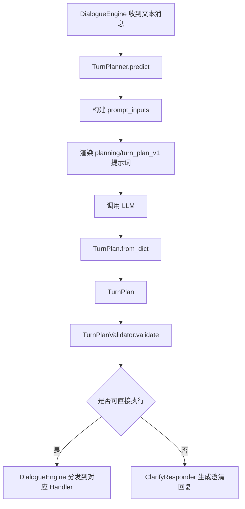
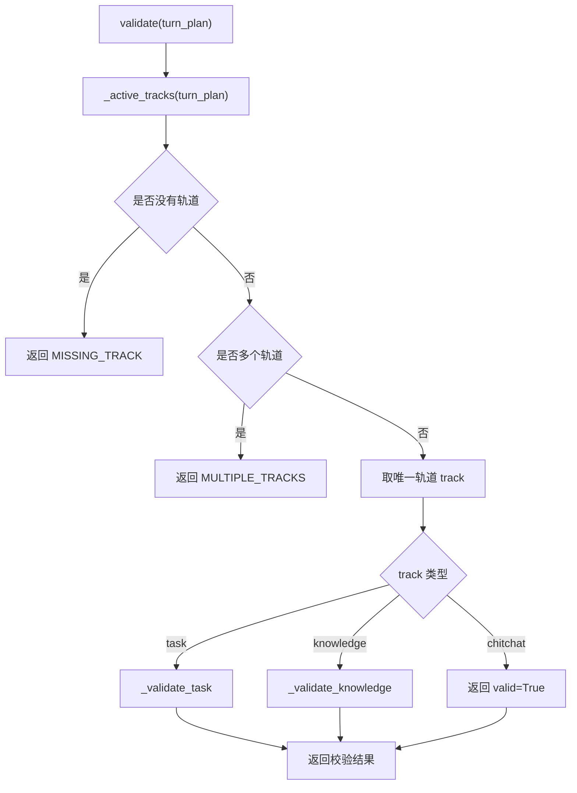
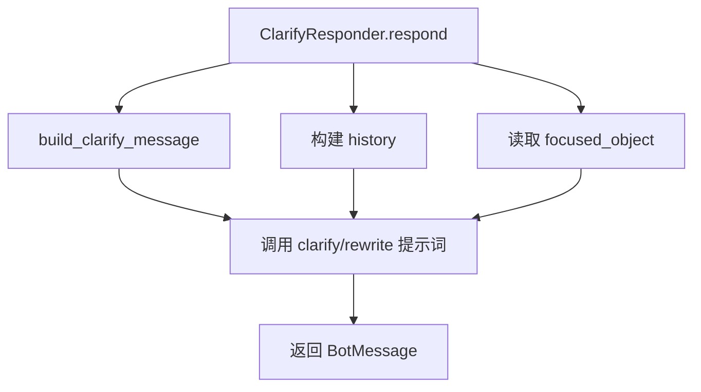

# 1. 概述

`TurnPlanner` 负责根据用户当前输入和对话状态，生成本轮对话计划 `TurnPlan`。

整体流程如下：



这里有一个重要边界：

- `TurnPlanner`：负责真实识别用户意图，可以识别出多个轨道。
- `TurnPlanValidator`：负责判断当前执行引擎是否能直接处理。
- `DialogueEngine`：只在校验通过后，分发到一个具体 Handler。

当前系统支持三个轨道：

- `task`：任务型流程，例如查订单、查物流、申请退款。
- `knowledge`：知识问答，例如商品信息、退款政策、配送规则。
- `chitchat`：闲聊，例如打招呼、询问助手身份。

# 2. TurnPlanner

## 2.1 TurnPlan JSON

LLM 输出的 `TurnPlan` 是一个 JSON 对象，顶层固定包含三个字段：

```json
{
  "task": null,
  "knowledge": null,
  "chitchat": null
}
```

如果用户是在办理业务，填写 `task`：

```json
{
  "task": {
    "commands": [
      {"command": "start_flow", "flow": "refund_request"}
    ]
  },
  "knowledge": null,
  "chitchat": null
}
```

如果用户是在咨询知识，填写 `knowledge`：

```json
{
  "task": null,
  "knowledge": {
    "intents": ["refund_policy"]
  },
  "chitchat": null
}
```

如果用户是在闲聊，填写 `chitchat`：

```json
{
  "task": null,
  "knowledge": null,
  "chitchat": {}
}
```

如果用户一句话同时表达多个意图，LLM 也可以同时填写多个轨道：

```json
{
  "task": {
    "commands": [
      {"command": "start_flow", "flow": "refund_request"}
    ]
  },
  "knowledge": {
    "intents": ["refund_policy"]
  },
  "chitchat": null
}
```

多意图 `TurnPlan` 会被 `TurnPlanValidator` 认定为当前引擎不能直接执行，然后引导用户澄清先处理哪一个。

## 2.2 TurnPlan 模型

与 JSON 对应的 Python 模型如下：

```python
@dataclass
class TaskTurnPlan:
    commands: list[Command] = field(default_factory=list)

    @classmethod
    def from_dict(cls, data: dict) -> "TaskTurnPlan":
        return cls(commands=[Command.from_dict(command) for command in data["commands"]])


@dataclass
class KnowledgeTurnPlan:
    intents: list[str] = field(default_factory=list)

    @classmethod
    def from_dict(cls, data: dict) -> "KnowledgeTurnPlan":
        return cls(intents=data["intents"])


@dataclass
class ChitchatTurnPlan:
    pass


@dataclass(slots=True)
class TurnPlan:
    task: TaskTurnPlan | None = None
    knowledge: KnowledgeTurnPlan | None = None
    chitchat: ChitchatTurnPlan | None = None

    @classmethod
    def from_dict(cls, data: dict) -> "TurnPlan":
        return cls(
            task=TaskTurnPlan.from_dict(data["task"]) if data.get("task") is not None else None,
            knowledge=KnowledgeTurnPlan.from_dict(data["knowledge"]) if data.get("knowledge") is not None else None,
            chitchat=ChitchatTurnPlan() if data.get("chitchat") is not None else None,
        )
```

`TaskTurnPlan` 对应 JSON 中的 `task` 字段，内部保存 `commands`。

`KnowledgeTurnPlan` 对应 JSON 中的 `knowledge` 字段，内部保存 `intents`。

`ChitchatTurnPlan` 对应 JSON 中的 `chitchat` 字段，当前不需要额外参数。

`from_dict()` 负责把 LLM 输出的 JSON 字典转换成对应模型。

## 2.3 TurnPlanner具体实现

### 2.3.1 入口代码

`TurnPlanner.predict()` 是本组件的入口方法。

```python
class TurnPlanner:
    async def predict(
            self,
            state: DialogueState,
            flows: FlowsList,
            knowledge_intents: dict[str, KnowledgeIntent],
    ) -> TurnPlan:
        prompt_inputs = self._build_prompt_inputs(state, flows, knowledge_intents)
        return await self._predict_from_prompt_inputs(prompt_inputs)
```

这个方法接收三类信息：

- `state`：当前对话状态。
- `flows`：系统支持的任务流程。
- `knowledge_intents`：系统支持的知识意图。

入口方法内部调用了两个方法：

- `build_prompt_inputs()`：把当前状态、可用 flow、知识意图整理成提示词变量。
- `_predict_from_prompt_inputs()`：使用提示词变量调用 LLM，并把输出转换成 `TurnPlan`。

### 2.3.2  提示词

提示词具体内容如下：

````jinja2
## 任务说明
你的任务是分析当前对话上下文，并生成一个 TurnPlan JSON。

TurnPlan 顶层只允许以下三个字段：
- `task`
- `knowledge`
- `chitchat`

规则：
- 这三个字段的值必须是 JSON 对象或 null。
- 请根据用户真实表达的意图生成结果。
- 如果用户同时表达了多个意图，可以同时填写多个轨道。
- 后续执行引擎一次只能处理一个轨道；如果你输出多个轨道，系统会再向用户澄清先处理哪一个。
- 不要输出额外字段。
- 只输出合法 JSON，不要输出 markdown。
- 最终答案只能是 JSON 文本本身，不要使用 Markdown 代码块包裹，例如以三个反引号和 json 开头的结构。

---

## Task 结构
当用户是在办理业务时，填写 `task`：

Task 对象示例：
{
  "commands": [
    {"command": "start_flow", "flow": "<flow_id>"},
    {"command": "resume_flow", "flow": "<flow_id>"},
    {"command": "cancel_flow"},
    {"command": "set_slots", "slots": {"<slot_name>": "<value>"}}
  ]
}

仅允许以下 task commands：
- `start_flow`
- `resume_flow`
- `cancel_flow`
- `set_slots`

可用 flows：
{{ available_flows_json }}

---

## Knowledge 结构
当用户是在咨询信息时，填写 `knowledge`：

Knowledge 对象示例：
{
  "intents": ["<intent>"]
}

允许的 intent（从下列选项中选择，可以选择一个或多个）：
{{ knowledge_intents_json }}

---

## Chitchat 结构
当用户是在闲聊时，填写 `chitchat`：

Chitchat 对象示例：
{}

---

## 当前状态

### Active Task
{{ active_task_json }}

### Interrupted Tasks
{{ interrupted_tasks_json }}

### Focused Object
{{ focused_object_json }}

---

## 对话历史
{{ current_conversation }}

---

## 当前任务
请根据用户最后一句话生成 TurnPlan：
"""{{ user_message }}"""

TurnPlan 只允许输出以下形状：

{
  "task": null,
  "knowledge": null,
  "chitchat": null
}

请根据用户真实意图，把对应字段替换成对象；没有命中的字段保持 null。

不要输出解释。
不要使用 markdown 代码块。
你的 TurnPlan：
````

提示词中使用的参数如下：

- `available_flows_json`：系统当前支持的任务流程列表。LLM 会根据它判断用户是否要启动某个业务流程。

```json
{
  "flows": [
    {
      "id": "return_order",
      "description": "申请退货",
      "slots": [
        {"name": "order_id", "description": "订单号"},
        {"name": "reason", "description": "退货原因"}
      ]
    },
    {
      "id": "change_address",
      "description": "修改收货地址",
      "slots": [
        {"name": "order_id", "description": "订单号"},
        {"name": "address", "description": "新的收货地址"}
      ]
    }
  ]
}
```

- `knowledge_intents_json`：系统当前支持的知识意图列表。LLM 会根据它选择一个或多个知识意图。

```json
[
  {
    "id": "refund_policy",
    "description": "退货退款规则"
  },
  {
    "id": "shipping_fee",
    "description": "运费规则"
  }
]
```

- `active_task_json`：当前正在执行的任务。如果用户继续补充信息，LLM 可以据此生成 `set_slots` 等命令。

```json
{
  "flow_id": "return_order",
  "flow_name": "申请退货",
  "step_id": "collect_reason",
  "slots": {
    "order_id": "O1001"
  }
}
```

- `interrupted_tasks_json`：当前被暂停的任务列表。如果用户表达“继续之前的任务”，LLM 可以据此生成 `resume_task`。

```json
[
  {
    "flow_id": "return_order",
    "flow_name": "申请退货",
    "step_id": "collect_reason",
    "slots": {
      "order_id": "O1001"
    }
  },
  {
    "flow_id": "change_address",
    "flow_name": "修改收货地址",
    "step_id": "collect_address",
    "slots": {
      "order_id": "O1002"
    }
  }
]
```

- `focused_object_json`：当前对话中聚焦的业务对象，例如某个商品或订单。它可以帮助 LLM 判断用户是在咨询对象相关知识，还是要办理对象相关业务。

```json
{
  "type": "order",
  "id": "O1001",
  "title": "订单 O1001",
  "attributes": {
    "status": "已发货",
    "amount": 199,
    "product_name": "无线耳机"
  }
}
```

- `current_conversation`：最近的对话历史。它让 LLM 在判断当前意图时能够参考上下文。

```text
用户：我想退货
助手：请提供订单号
用户：O1001
助手：请说明退货原因
```

- `user_message`：用户本轮输入的原始文本。TurnPlan 的预测主要围绕这句话展开。

```text
我想继续刚才的退货申请
```

### 2.3.3 构造提示词输入

`build_prompt_inputs()` 负责把当前对话状态转换成提示词需要的变量。

这一步不会调用 LLM，也不会修改状态，只是做数据整理。

核心代码如下：

```python
def _build_prompt_inputs(
    self, 
    state: DialogueState, 
    flows: FlowsList,
    knowledge_intents: dict[str, KnowledgeIntent]
) -> dict[str, Any]:
    user_message = HistoryBuilder._render_user_message(state.pending_turn.user_message)
    history = HistoryBuilder.build(state.current_session().turns)
    active_task = state.active_task
    focused_object = state.focused_object
    _flows: list[Flow] = flows.flows
    return {
        "current_conversation": history,
        "user_message": user_message,
        "available_flows_json": json.dumps(
            {
                "flows": [{k: v for k, v in asdict(flow).items() if k != "steps"} for flow in _flows]
            },
            ensure_ascii=False,
        ),
        "active_task_json": json.dumps(
            asdict(active_task) if active_task is not None else None,
            ensure_ascii=False,
        ),
        "interrupted_tasks_json": json.dumps(
            [asdict(task) for task in state.paused_tasks],
            ensure_ascii=False,
        ),
        "focused_object_json": json.dumps(
            asdict(focused_object) if focused_object is not None else None,
            ensure_ascii=False,
        ),
        "knowledge_intents_json": json.dumps(
            [
                {"id": intent.id, "description": intent.description}
                for intent in knowledge_intents.values()
            ],
            ensure_ascii=False,
        ),
    }
```

返回的这些变量会被传入 `planning/turn_plan_v1.jinja2`。

`current_conversation` 表示最近对话历史，并追加了当前用户消息。

`available_flows_json` 表示系统支持哪些任务流程。

`active_task_json` 和 `interrupted_tasks_json` 表示当前是否有正在执行或被暂停的任务。

`focused_object_json` 表示当前聚焦的商品或订单。

`knowledge_intents_json` 表示系统支持哪些知识意图。

### 2.3.4 调用LLM

`_predict_from_prompt_inputs()` 负责真正调用 LLM。

```python
async def _predict_from_prompt_inputs(
        self,
        prompt_inputs: dict[str, Any],
) -> TurnPlan:
    prompt_text = load_prompt("turn_plan")
    prompt = PromptTemplate.from_template(
        prompt_text,
        template_format="jinja2"
    )

    chain = prompt | llm | JsonOutputParser()
    llm_output = await chain.ainvoke(prompt_inputs)
    return TurnPlan.from_dict(llm_output)
```

这里使用 LangChain 的链式写法：

```text
prompt -> llm -> output_parser
```

执行结果是一个 JSON 字符串。代码先用 `json.loads()` 转成字典，再通过 `TurnPlan.from_dict()` 转成 `TurnPlan` 对象。


# 3. TurnPlanValidator

## 3.1 校验结果定义

`TurnPlanValidator` 的返回值是 `TurnPlanValidationResult`。它表达当前 `TurnPlan` 是否可以执行，以及校验失败的原因。

```python
class ClarifyReason(str, Enum):
    MISSING_TRACK = "missing_track"
    MULTIPLE_TRACKS = "multiple_tracks"
    MISSING_TASK_COMMANDS = "missing_task_commands"
    MISSING_KNOWLEDGE_INTENT = "missing_knowledge_intent"
    MISSING_FOCUSED_OBJECT = "missing_focused_object"
    OBJECT_REQUIRES_INTENT = "object_requires_intent"


@dataclass
class TurnPlanValidationResult:
    valid: bool
    reason: ClarifyReason | None = None
```

字段含义如下：

- `valid`：当前计划是否可以直接执行。
- `reason`：校验失败原因。

`ClarifyReason` 是固定枚举，用来描述系统为什么需要澄清。这样可以避免在代码中到处手写字符串。

每个原因的含义如下：

- `MISSING_TRACK`：`TurnPlan` 没有命中任何轨道。也就是 `task`、`knowledge`、`chitchat` 都是 `null`，系统无法判断本轮应该做什么。
- `MULTIPLE_TRACKS`：`TurnPlan` 同时命中了多个轨道。比如用户同时表达了“我要退货”和“顺便问下运费规则”，而当前执行引擎一次只能处理一个轨道。
- `MISSING_TASK_COMMANDS`：命中了 `task` 轨道，但 `commands` 为空。也就是系统知道用户想办业务，但不知道具体要执行什么命令。
- `MISSING_KNOWLEDGE_INTENT`：命中了 `knowledge` 轨道，但 `intents` 为空。也就是系统知道用户在咨询信息，但不知道要查询哪类知识。
- `MISSING_FOCUSED_OBJECT`：知识意图需要聚焦对象，但当前状态中没有合适的 `focused_object`。例如用户问“这个能退吗”，但系统还不知道“这个”指哪个商品或订单。
- `OBJECT_REQUIRES_INTENT`：用户只发送了商品或订单对象，但没有说明想做什么。对象已经被记录为 `focused_object`，系统需要继续询问用户是要查询信息、办理业务，还是咨询售后。

## 3.2 校验逻辑

### 3.2.1 入口代码

`TurnPlanValidator` 的入口代码如下：

```python
class TurnPlanValidator:
    def validate(
            self,
            turn_plan: TurnPlan,
            state: DialogueState,
            knowledge_intents: dict[str, KnowledgeIntent],
    ) -> TurnPlanValidationResult:
        active_tracks = self._active_tracks(turn_plan)
        if not active_tracks:
            return self._reject(ClarifyReason.MISSING_TRACK)
        if len(active_tracks) > 1:
            return self._reject(ClarifyReason.MULTIPLE_TRACKS)

        track = active_tracks[0]
        if track == "task":
            return self._validate_task(turn_plan)
        if track == "knowledge":
            return self._validate_knowledge(turn_plan, state=state, knowledge_intents=knowledge_intents)
        return TurnPlanValidationResult(valid=True)

    @staticmethod
    def _active_tracks(turn_plan: TurnPlan) -> list[str]:
        tracks: list[str] = []
        if turn_plan.task is not None:
            tracks.append("task")
        if turn_plan.knowledge is not None:
            tracks.append("knowledge")
        if turn_plan.chitchat is not None:
            tracks.append("chitchat")
        return tracks
```

整体流程如下：



这体现了当前系统的执行约束：`TurnPlanner` 可以识别多个意图，但 `DialogueEngine` 一次只能执行一个轨道。

### 3.2.2 task 校验

task 轨道只校验 commands 是否为空。

```python
def _validate_task(
        self,
        turn_plan: TurnPlan,
) -> TurnPlanValidationResult:
    task_plan = turn_plan.task
    if task_plan is None or not task_plan.commands:
        return self._reject(ClarifyReason.MISSING_TASK_COMMANDS)

    return TurnPlanValidationResult(valid=True)
```

具体 command 是否能执行，由后续 `TaskHandler` 和 `CommandProcessor` 处理。

### 3.2.3 knowledge 校验

knowledge 轨道校验两件事：

- `intents` 不能为空。
- 如果某个 intent 要求聚焦对象，则当前状态中必须有对应类型的 `focused_object`。

```python
def _validate_knowledge(
        self,
        turn_plan: TurnPlan,
        state: DialogueState,
        knowledge_intents: dict[str, KnowledgeIntent],
) -> TurnPlanValidationResult:
    knowledge_plan = turn_plan.knowledge
    if knowledge_plan is None or not knowledge_plan.intents:
        return self._reject(ClarifyReason.MISSING_KNOWLEDGE_INTENT)

    focused_object = state.focused_object
    for intent in knowledge_plan.intents:
        intent_meta = knowledge_intents[intent]
        required_object = intent_meta.requires_object
        if required_object is not None:
            if focused_object is None or focused_object.type != required_object:
                return self._reject(ClarifyReason.MISSING_FOCUSED_OBJECT)

    return TurnPlanValidationResult(valid=True)
```

例如：

- `product_info` 需要当前聚焦商品。
- `order_info` 需要当前聚焦订单。
- `refund_policy`、`shipping_policy` 这类规则咨询不一定需要聚焦对象。

### 3.2.4 失败结果

当校验失败时，`TurnPlanValidator` 会调用 `_reject()` 构造失败结果。

这里不会直接回复用户，也不会生成澄清话术，只记录失败原因。

```python
def _reject(
        self,
        reason: ClarifyReason,
) -> TurnPlanValidationResult:
    return TurnPlanValidationResult(
        valid=False,
        reason=reason,
    )
```

后续 `DialogueEngine` 会把 `reason` 交给 `ClarifyResponder`，由 `ClarifyResponder` 决定如何生成澄清回复。

# 4. ClarifyResponder

## 4.1 概述

`ClarifyResponder` 负责把澄清原因转换成最终的 `BotMessage`。

它接收两类信息：

- `state`：当前对话状态，用来获取历史对话和聚焦对象。
- `reason`：澄清原因。

它的整体处理思路是：

1. 根据 `reason` 和 `state` 生成一条基础澄清话术。
2. 读取当前对话历史和聚焦对象。
3. 调用 `clarify/rewrite` 提示词，把基础话术改写成自然的客服回复。
4. 返回 `BotMessage`。

具体流程如下：



`TurnPlanValidator` 只负责判断失败原因，`ClarifyResponder` 负责生成基础澄清话术，并把它改写成自然的客服回复。

## 4.2 澄清提示词

`ClarifyResponder` 使用的提示词下

```jinja2
你是一个中文电商客服助手，语气自然、友好、简洁。
你的任务是把一条系统澄清提示改写成更自然的一句话，不要扩写，不要新增信息，不要改变澄清意图。

澄清原因：{{ reason }}
建议回复：{{ clarify_message }}

当前聚焦对象：{{ focused_object }}


对话历史：
{{ history }}

用户最后一句：{{ user_message }}

改写后的回复：
```

提示词变量说明如下：

- `reason`：澄清原因，对应 `ClarifyReason` 的枚举值，例如 `missing_track`、`multiple_tracks`。
- `clarify_message`：基础澄清话术，由 `build_clarify_message()` 根据 `reason` 和 `state` 生成。
- `focused_object`：当前聚焦对象的简要描述。如果当前没有聚焦商品或订单，这个变量为空，提示词中的对象信息不会出现。
- `history`：当前会话历史，并追加本轮用户消息。它帮助 LLM 在改写时保持上下文连贯。
- `user_message`：用户本轮输入的文本，用来帮助 LLM 理解澄清回复应该贴合哪句话。

示例：

```text
reason = "multiple_tracks"
clarify_message = "你这次同时提到了多个方向。我们先处理一个，你想先办业务还是先咨询信息呢？"
focused_object = "type=order, id=O1001, title=订单 O1001"
history = "用户：我想退货，顺便问下运费规则"
user_message = "我想退货，顺便问下运费规则"
```

## 4.3 源码

`ClarifyResponder.respond()` 为入口方法

```python
class ClarifyResponder:

    async def respond(
            self,
            state: DialogueState,
            reason: ClarifyReason,
    ) -> list[BotMessage]:
        message = state.pending_turn.user_message
        clarify_message = self.build_clarify_message(reason=reason, state=state)
        user_message = HistoryBuilder._render_user_message(message)
        history = HistoryBuilder.build(state.current_session().turns)
        focused_object = json.dumps(state.focused_object.to_dict())
        prompt_text = load_prompt("clarify_respond")
        prompt = PromptTemplate.from_template(
            prompt_text,
            template_format="jinja2"
        )
        chain = prompt | llm | StrOutputParser()
        rewritten = (
            await chain.ainvoke(
                {
                    "reason": reason.value,
                    "clarify_message": clarify_message,
                    "focused_object": focused_object,
                    "history": history,
                    "user_message": user_message
                }
            )
        )
        return [BotMessage(text=rewritten)]


```

`build_clarify_message()` 是 `ClarifyResponder` 使用的基础话术生成函数。它根据 `reason` 和 `state` 生成一条系统建议回复。

```python
def build_clarify_message(self,
                          reason: ClarifyReason,
                          state: DialogueState,
                          ) -> str:
    if reason is ClarifyReason.MULTIPLE_TRACKS:
        return "你这次同时提到了多个方向。我们先处理一个，你想先办业务还是先咨询信息呢？"

    if reason is ClarifyReason.MISSING_FOCUSED_OBJECT:
        return "请先发送你想咨询的商品或订单，我再继续帮你看。"

    if reason is ClarifyReason.MISSING_KNOWLEDGE_INTENT:
        return "你是想了解商品信息、订单信息，还是售后配送规则呢？"

    if reason is ClarifyReason.MISSING_TRACK:
        return "你是想先处理业务问题，还是先咨询信息呢？"

    if reason is ClarifyReason.MISSING_TASK_COMMANDS:
        return "你这次是想办理什么业务呢？比如查订单、查物流，或者申请退款。"

    if reason is ClarifyReason.OBJECT_REQUIRES_INTENT:
        focused_object = state.focused_object
        if focused_object is not None and focused_object.type == "order":
            return "我已经收到这个订单了。你想查订单状态、查物流，还是申请退款呢？"
        if focused_object is not None and focused_object.type == "product":
            return "我已经收到这个商品了。你想了解它的商品信息、发货情况，还是售后相关问题呢？"

    return "我还需要再确认一下你的意思，你可以换个更具体的说法告诉我。"
```
