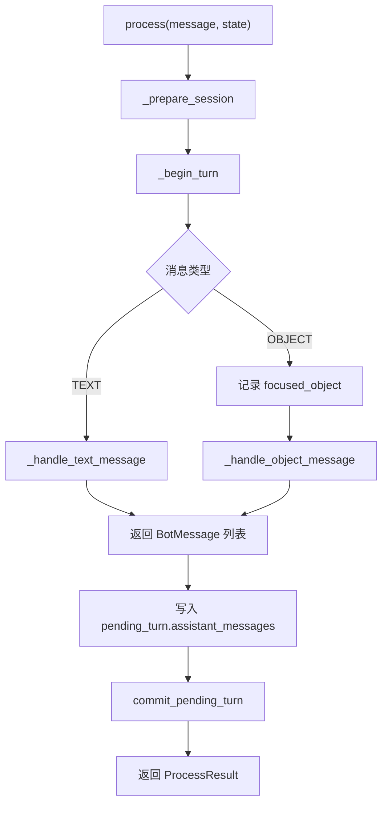
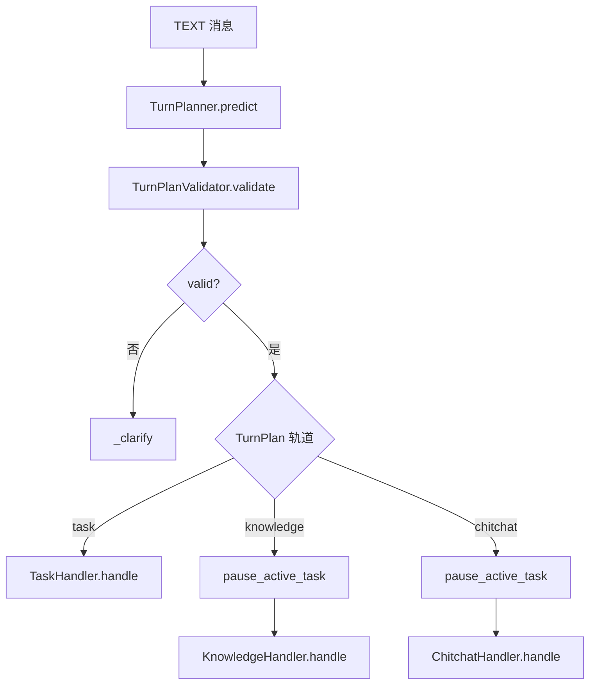
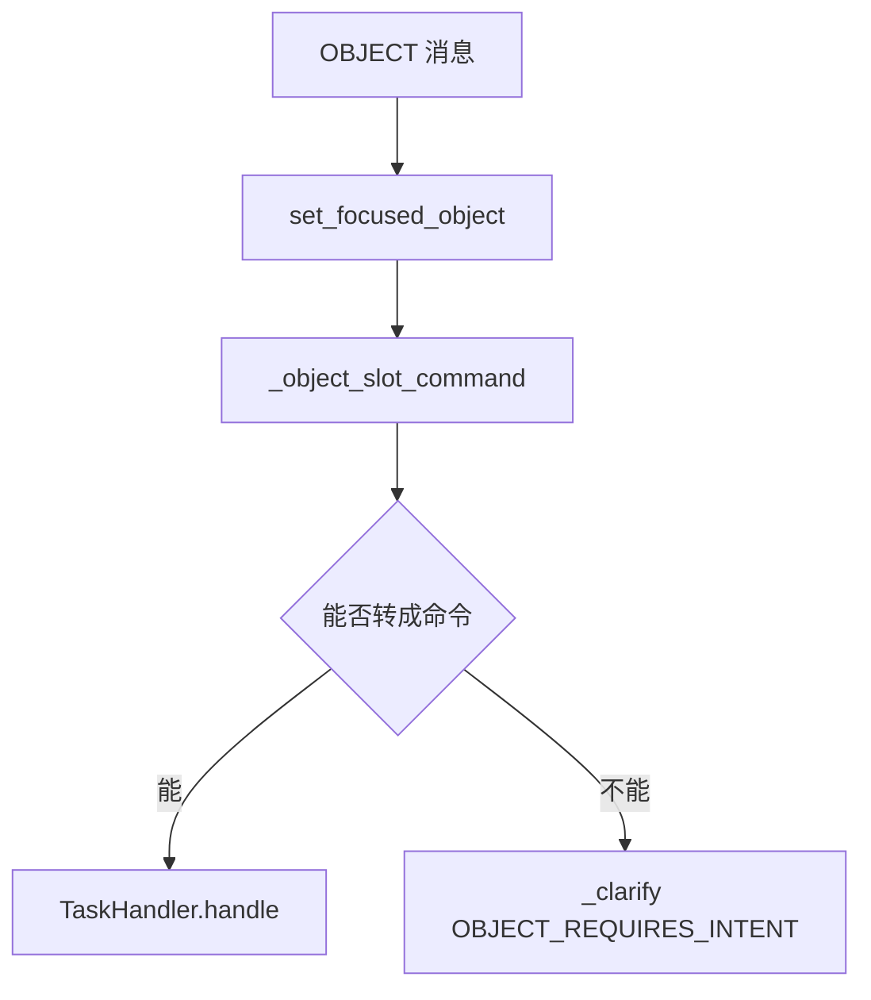

# 1. 概述

`DialogueEngine` 是整个对话系统的总调度器。

前面已经分别实现了：

- `TaskHandler`：处理业务任务。
- `KnowledgeHandler`：处理知识咨询。
- `ChitchatHandler`：处理闲聊。
- `TurnPlanner`：预测本轮用户意图。
- `TurnPlanValidator`：校验本轮计划是否可以执行。
- `ClarifyResponder`：生成澄清回复。

`DialogueEngine` 的职责就是把这些组件串起来。

它不负责具体业务逻辑，也不直接查询知识库，更不直接执行 flow。它只负责判断本轮消息应该交给谁处理，并把处理结果写入当前对话轮次。

整体流程如下：



# 2. 初始化

`DialogueEngine` 通过构造函数接收各个核心组件。

```python
class DialogueEngine:
    def __init__(
            self,
            turn_planner: TurnPlanner,
            task_handler: TaskHandler,
            knowledge_handler: KnowledgeHandler,
            chitchat_handler: ChitchatHandler,
            clarify_responder: ClarifyResponder,
            turn_plan_validator: TurnPlanValidator
    ) -> None:
        self.turn_planner = turn_planner
        self.task_handler = task_handler
        self.knowledge_handler = knowledge_handler
        self.chitchat_handler = chitchat_handler
        self.clarify_responder = clarify_responder
        self.turn_plan_validator = turn_plan_validator
```

这里的核心是依赖注入：`DialogueEngine` 不自己创建这些组件，而是由外部组装好后传进来。

这样做的好处是：每个组件职责独立，`DialogueEngine` 只负责调度。

# 3. process 主流程

`process()` 是 `DialogueEngine` 的入口方法。

```python
async def process_message(self, state: DialogueState, user_message: UserMessage) -> ProcessResult:
    """处理一条消息，直接修改 state，返回本轮结果。"""
    self._prepare_session(state)
    self._begin_turn(state, user_message)

    if user_message.type is MessageType.TEXT:
        messages = await self._handle_text_message(
            state=state,
        )
    else:
        state.set_focused_object(FocusedObject.from_dict(user_message.object.to_dict()))
        messages = await self._handle_object_message(
            message=user_message,
            state=state,
        )

    state.pending_turn.bot_messages.extend(messages)
    state.commit_pending_turn()

    return ProcessResult(
        sender_id=user_message.sender_id,
        message_id=user_message.message_id,
        messages=messages,
    )
```

这段代码可以分成五步：

1. 准备会话。
2. 开启本轮 `Turn`。
3. 根据消息类型选择处理逻辑。
4. 把返回的消息写入 `pending_turn`。
5. 提交本轮 `Turn`，返回 `ProcessResult`。

`process()` 本身不处理具体业务，它只是把本轮消息分派给合适的方法。

# 4. Session 与 Turn 生命周期

`process()` 开始时会先准备会话。

```python
def _prepare_session(self, state: DialogueState) -> None:
    session = state.current_session()
    now = time.time()
    if session is None:
        state.start_session()
        return
    if now - session.last_activity_at > 60 * 60:
        state.close_current_session()
        state.reset_runtime_state_for_new_session()
        state.start_session()
    else:
        session.last_activity_at = now
```

这里处理两种情况：

1. 当前没有 session，就开启一个新 session。
2. 当前 session 超时，就关闭旧 session，重置运行状态，再开启新 session。

会话准备好之后，`DialogueEngine` 会开启本轮 `Turn`。

```python
@staticmethod
def _begin_turn(state: DialogueState, message: Message) -> None:
    state.begin_turn(message)
```

消息处理完成后，`process()` 会把生成的回复写入当前 `pending_turn`：

```python
state.pending_turn.assistant_messages.extend(messages)
```

然后提交本轮：

```python
state.commit_pending_turn()
```

最后返回 `ProcessResult`：

```python
return ProcessResult(
    sender_id=message.sender_id,
    message_id=message.message_id,
    messages=messages,
)
```

因此，`DialogueEngine` 是本轮对话的边界：

```text
prepare session -> begin turn -> 调用组件处理 -> 写入消息 -> commit turn -> 返回结果
```

# 5. TEXT 消息

文本消息会走 `_handle_text_message()`。

```python
async def _handle_text_message(
        self,
        state: DialogueState,
) -> list[BotMessage]:
    turn_plan = await self.turn_planner.predict(
        state, self.task_handler.flows, self.knowledge_handler.knowledge_intents
    )
    validation = self.turn_plan_validator.validate(
        turn_plan, state=state, knowledge_intents=self.knowledge_handler.knowledge_intents,
    )
    if not validation.valid:
        return await self._clarify(
            state=state,
            reason=validation.reason,
        )

    if turn_plan.task is not None:
        return await self.task_handler.handle(
            commands=turn_plan.task.commands,
            state=state,
        )
    elif turn_plan.knowledge is not None:
        if state.active_task:
            state.interrupt_active_task()
        return await self.knowledge_handler.handle(
            state=state,
            intents=turn_plan.knowledge.intents,
        )

    if state.active_task:
        state.interrupt_active_task()
    return await self.chitchat_handler.handle(state=state)
```

处理流程如下：



这里有一个重要设计：校验通过后，`DialogueEngine` 直接根据 `TurnPlan` 分发。

- `turn_plan.task is not None`：交给 `TaskHandler`。
- `turn_plan.knowledge is not None`：暂停当前任务，交给 `KnowledgeHandler`。
- 其他情况：暂停当前任务，交给 `ChitchatHandler`。

知识咨询和闲聊都会暂停当前任务，因为它们会临时离开业务任务轨道。

# 6. OBJECT 消息

对象消息是指用户发送了一个结构化对象，例如商品或订单。

在 `process()` 中，系统会先记录聚焦对象：

```python
if message.type is MessageType.OBJECT:
    state.set_focused_object(message.object)
```

然后进入 `_handle_object_message()`。

```python
async def _handle_object_message(
        self,
        message: UserMessage,
        state: DialogueState,
) -> list[BotMessage]:
    command = self._object_slot_command(
        message=message,
        state=state,
        flows=self.task_handler.flows,
    )
    if command is None:
        return await self._clarify(
            state=state,
            reason=ClarifyReason.OBJECT_REQUIRES_INTENT,
        )

    return await self.task_handler.handle(commands=[command], state=state)
```

对象消息有两种处理结果：

- 如果当前任务正在收集这个对象 ID，就把对象转换成 `SetSlotsCommand`。
- 如果不能直接填槽，就触发 `OBJECT_REQUIRES_INTENT` 澄清，让用户说明想做什么。

流程如下：



## 6.1 对象转命令

`_object_slot_command()` 负责判断对象消息是否可以直接填入当前任务的 slot。

```python
def _object_slot_command(
        self,
        message: UserMessage,
        state: DialogueState,
        flows: FlowsList,
) -> Command | None:
    message_object = message.object
    object_type = message_object.type.strip().lower()
    collect_slot_name = self._current_collect_slot_name(state=state, flows=flows)

    if object_type == "order" and collect_slot_name == "order_number":
        return SetSlotsCommand(
            command="set_slots",
            slots={"order_number": message_object.id},
        )
    if object_type == "product" and collect_slot_name == "product_id":
        return SetSlotsCommand(
            command="set_slots",
            slots={"product_id": message_object.id},
        )

    return None
```

例如，当前任务正在收集 `order_number`，用户发送了一个订单对象：

```json
{
  "type": "order",
  "id": "O1001",
  "title": "订单 O1001"
}
```

那么系统会生成：

```python
SetSlotsCommand(
    command="set_slots",
    slots={"order_number": "O1001"},
)
```

然后交给 `TaskHandler` 继续推进业务流程。

## 6.2 当前收集槽位

`_current_collect_slot_name()` 用来判断当前系统正在收集哪个 slot。

```python
@staticmethod
def _current_collect_slot_name(
        state: DialogueState,
        flows: FlowsList,
) -> str | None:
    if isinstance(state.active_system_task, CollectSystemContext):
        return state.active_system_task.slot_name or None

    active_task = state.active_task
    if active_task is None:
        return None
    current_flow = flows.get_flow_by_id(active_task.flow_id)
    current_step = current_flow.get_step_by_id(active_task.step_id)
    if not isinstance(current_step, CollectSlotStep):
        return None
    return current_step.slot_name

```

它先看当前是否处在系统收集流程中：

```python
state.active_system_task
```

如果是，就直接返回系统流程正在收集的 slot。

如果不是，再看当前业务任务：

```python
state.active_task
```

只有当前 step 是 `CollectSlotStep` 时，才返回它的 `slot_name`。

# 7. 澄清回复

当系统无法直接处理本轮消息时，会调用 `_clarify()`。

```python
async def _clarify(
        self,
        state: DialogueState,
        reason: ClarifyReason,
) -> list[BotMessage]:
    return await self.clarify_responder.respond(
        state=state,
        reason=reason,
)
```

`DialogueEngine` 不自己写澄清话术，只把 `reason` 交给 `ClarifyResponder`。

这样职责更清楚：

- `TurnPlanValidator`：判断为什么不能执行。
- `DialogueEngine`：决定需要澄清。
- `ClarifyResponder`：生成具体回复。

# 8. Builder

`DialogueEngine` 的组件由 `build_dialogue_engine()` 统一创建和组装。

```python
_PROJECT_ROOT = Path(__file__).parents[2]
_FLOW_CONFIG_DIR = _PROJECT_ROOT / "flow_config"
_FLOW_CONFIG_FILES = ("user_flows.yml", "system_flows.yml")


def build_dialogue_engine() -> DialogueEngine:
    flow_paths = [_FLOW_CONFIG_DIR / f for f in _FLOW_CONFIG_FILES]
    flows = FlowLoader().load_many(flow_paths)
    return DialogueEngine(
        turn_planner=TurnPlanner(),
        task_handler=TaskHandler(
            flows=flows,
            command_processor=CommandProcessor(),
            flow_executor=FlowExecutor(),
            action_runner=build_action_runner()
        ),
        knowledge_handler=KnowledgeHandler(
            knowledge_intents=KNOWLEDGE_INTENTS,
            knowledge_responder=KnowledgeResponder(),
            provider_registry=KnowledgeProviderRegistry(
                [
                    ProductAPIProvider(),
                    OrderAPIProvider(),
                    FAQProvider(),
                    RAGProvider(),
                ]
            ),
        ),
        chitchat_handler=ChitchatHandler(
            responder=ChitchatResponder()
        ),
        clarify_responder=ClarifyResponder(),
        turn_plan_validator=TurnPlanValidator()
    )

```

这里主要完成四件事：

1. 加载 flow 配置。
2. 创建 `TaskHandler` 及其依赖。
3. 创建 `KnowledgeHandler` 和知识 Provider 注册表。
4. 创建 `ChitchatHandler`、`ClarifyResponder`、`TurnPlanner`、`TurnPlanValidator`，并注入到 `DialogueEngine`。

Builder 的作用是把对象创建逻辑集中到一个地方。这样 `DialogueEngine` 本身只关心调度，不关心组件如何创建。
