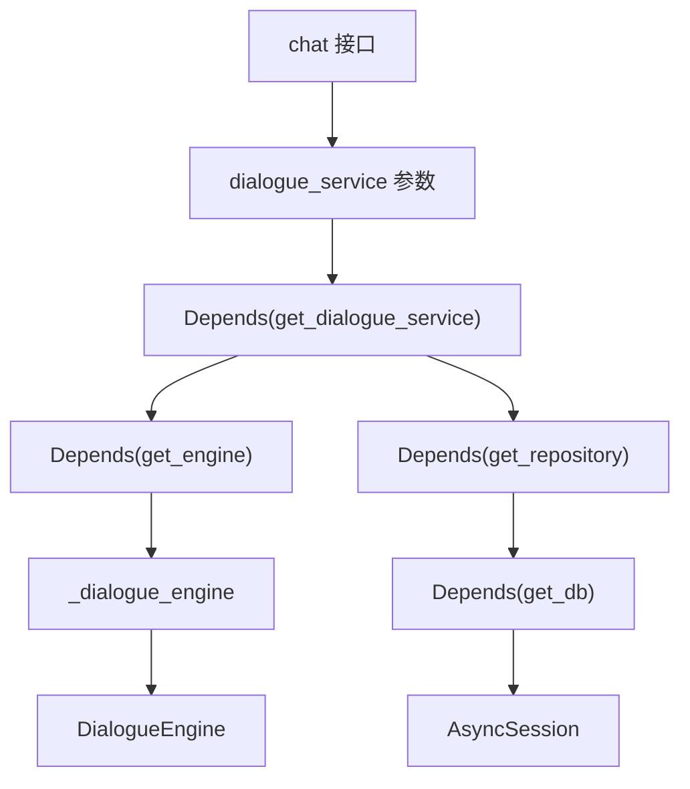

# 1. 概述

这一节只关注 FastAPI 项目中的两类内容：

- 依赖注入：接口函数需要的对象从哪里来。
- 生命周期：应用启动和关闭时要做什么。

# 2. 依赖注入

整体依赖关系如下：



代码如下：

```python
_dialogue_engine: DialogueEngine | None = None


def init_dialogue_engine() -> None:
    global _dialogue_engine
    _dialogue_engine = build_dialogue_engine()


def get_engine() -> DialogueEngine:
    return _dialogue_engine


async def get_db():
    async with database.session_factory() as session:
        yield session


async def get_repository(
        db: AsyncSession = Depends(get_db),
) -> DialogueStateRepository:
    return DialogueStateRepository(db)


async def get_dialogue_service(
        engine: DialogueEngine = Depends(get_engine),
        repository: DialogueStateRepository = Depends(get_repository),
) -> DialogueService:
    return DialogueService(dialogue_state_repository=repository, dialogue_engine=engine)

```

# 3. 应用生命周期

```python
@asynccontextmanager
async def lifespan(app: FastAPI):
    init_http_client()
    init_dialogue_engine()
    init_db_engine()
    yield
    await close_db_engine()
    await close_http_client()


app = FastAPI(lifespan=lifespan)
```
